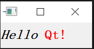
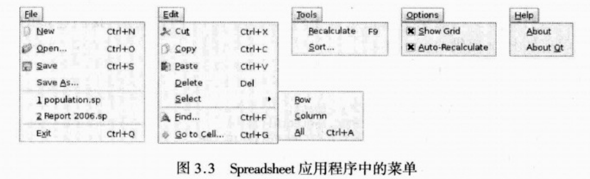

# C++ GUI Qt 4编程

原书的站点：`http://www.informit.com/title/0132354160`

也可以访问中文站点：`http://www.qtcn.org/gpq4/`


## 第一部分 Qt基础

### 第1章 Qt入门

这一章介绍如何创建一些简单的图像用户界面（Graphical User Interface,GUI）应用程序。

引入了Qt中两个重要的概念：

* 信号与槽
* 布局

#### 1.1 Hello Qt

简单的示例：QLabel的简单示例

`chapter1/hello.cpp`

```c++
#include <QApplication>
#include <QLabel>


int main(int argc, char *argv[])
{
	QApplication app(argc, argv);
	QLabel* label = new QLabel("Hello Qt!");
	label->show();
	return app.exec();
}
```

效果如下：


说明：

* `QApplication app(argc, argv);`

  创建了一个QApplication对象，用来管理整个应用程序所用到的资源。

  这个QApplication构造函数需要两个参数，分别是argc和argv，因为Qt支持它自己的一些命令行参数

* `return app.exec();`

  将应用程序的控制权传递给Qt。此时，程序会进入时间循环状态，这是一种等待模式，程序会等候用户的动作。

示例2：

可以简单的修改上述代码，让QLabel显示HTML样式格式

将

```c++
QLabel* label = new QLabel("Hello Qt!");
```

修改成

```c++
QLabel* label = new QLabel("<h2><i>Hello </i>"
                           "<font color=red>Qt!</font></h2>");
```

结果如下：



#### 1.2 建立连接

示例：

点击按钮退出程序

`quit.cpp`

```c++
#include <QApplication>
#include <QPushButton>


int main(int argc, char *argv[])
{
	QApplication app(argc, argv);
	QPushButton* button = new QPushButton("Quit");
	QObject::connect(button, SIGNAL(clicked()), &app, SLOT(quit()));

	button->show();
	return app.exec();
}
```

效果如下：


说明：

* 信号可以与函数相（在这里称为槽，slot）连接，以便在发射信号时，槽可以得到自动执行。
* 宏`SIGNAL()`和`SLOT()`是Qt语法中的一部分。


#### 1.3 窗口部件的布局

这一节用简单的例子说明：

* 如何用布局（layout）来管理窗口中窗口部件的几何形状
* 如何利用信号和槽来同步窗口部件

代码如下：

`layout.cpp`

```c++
#include <QApplication>
#include <QHBoxlayout>
#include <QSlider>
#include <QSpinBox>

int main(int argc, char *argv[])
{
	QApplication app(argc, argv);

	QWidget* window = new QWidget;
	window->setWindowTitle("Enter Your Age");

	QSpinBox *spinBox = new QSpinBox;
	QSlider* slider = new QSlider(Qt::Horizontal);
	spinBox->setRange(0, 130);
	slider->setRange(0, 130);

	QObject::connect(spinBox, SIGNAL(valueChanged(int)), 
					slider, SLOT(setValue(int)));
	QObject::connect(slider, SIGNAL(valueChanged(int)),
					spinBox, SLOT(setValue(int)));
	spinBox->setValue(35);

	QHBoxLayout* layout = new QHBoxLayout;
	layout->addWidget(spinBox);
	layout->addWidget(slider);
	window->setLayout(layout);
    
	window->show();
    
	return app.exec();
}
```

显示效果如下：


代码说明：

* 第8行和第9行创建了QWidget对象，并把它作为应用程序的主窗口。

* 第10行和第11行分别创建了一个QSpinBox和一个QSlider。本来应该把窗口(window)传递给QSpinBox和QSlider的构造函数，以说明两个窗口部件的父对象都是这个窗口，但在这里没有这个必要，因为系统布局会自行得出这一结果并自动把窗口设置为微调框和滑块的父对象。

* 第22行将微调框的值设置为35时，QSpinBox就会发射valueChanged(int)信号，其中，int参数的值是35，这个参数会被传递给QSlider的setValue(int)槽，它会把这个滑块的值设置为35。于是，滑块就会发射valueChanged(int)信号，因为它的值发生了变化，这样就触发了微调框的setValue(int)槽。但在这一点上，setValue(int)并不会再发射任何信号，因为微调框的值已经是35了。这样就可以避免无限循环的发生。图1.5对这种情况进行了概述：

  

* 第24行到27行，使用了一个布局管理器堆微调框和滑块进行布局处理。布局管理器（layout manager）就是一个能够对其所负责窗口部件的尺寸大小和位置进行设置的对象。Qt有三个主要的布局管理器类：

  * QHBoxLayout：在水平方向上排列窗口部件，从左到右（在某些文化中则是从右到左）
  * QVBoxLayout：在竖直方向上排列窗口部件，从上到下
  * QGridLayout：把各个窗口部件排列在一个网格中

* 第29行的`QWidget::setLayout()`函数调用会在窗口上安装该布局管理器（见图1.7）。从软件的底层实现上来说，QSpinBox和QSlider会自动“重定义父对象”，它们会成为这个安装了布局的窗口部件的子对象，也正是基于这种原因，当创建一个需要放进某个布局中的窗口部件时，就没必要显示的为其显式的制定父对象了。

  

	#### 1.4 使用参考文档

* 在Qt的`doc/html`目录下可以找到HTML格式的参考稳定
* 使用Qt的帮助浏览器`Qt Assistant`
* 在线参考文档：`http://doc.trolltech.com`


###  第3章 创建主窗口

#### 3.1 子类化QMainWindow

本章使用代码来完成所有的功能，而不使用Qt Designer

spreadsheet应用程序主窗口的源代码分别放在`mainwindow.h`和`mainwindow.cpp`中。

先分析头文件：

```cpp
#ifndef MAINWINDOW_H
#define MAINWINDOW_H

#include <QMainWindow>

class QAction;
class QLabel;
class FindDialog;
class Spreadsheet;

class MainWindow: public QMainWindow
{
	Q_OBJECT

public:
	MainWindow();

protected:
	void closeEvent(QCloseEvent *event);

private slots:
	void newFile();
	void open();
	bool save();
	bool saveAs();
	void find();
	void goToCell();
	void sort();
	void about();
	void openRecentFile();
	void updateStatusBar();
	void spreadsheetModified();

private:
	void createActions();
	void createMenus();
	void createContextMenu();
	void createToolBars();
	void createStatusBar();
	void readSettings();
	void writeSettings();
	bool okToContinue();
	bool loadFile(const QString &fileName);
	bool saveFile(const QString &fileName);
	void setCurrentFile(const QString &fileName);
	void updateRecentFile(const QString &fileName);
	QString strippedName(const QString &fullFileName);

	Spreadsheet *spreadsheet;
	FindDialog *findDialog;
	QLabel *locationLabel;
	QLabel *formulaLabel;
	QStringList recentFile;
	QString curFile;

	enum { MaxRecentFiles = 5 };
	QAction *recentFileActions[MaxRecentFiles];
	QAction *separatorAction;

	QMenu *fileMenu;
	QMenu *editMenu;

	QToolBar *fileToolBar;
	QToolBar *editToolBar;
	QAction *newAction;
	QAction *openAction;

	QAction *aboutQtAction;
};

#endif
```

说明：

* `closeEvent()`函数是QWdiget类中的一个虚函数，当用户关闭窗口时，这个函数会被自动调用。类MainWindow中程序实现了它，这样就可以向用户询问一个标准问题`Do you want to save your changes?`，并且可以把用户的一些偏好设置保存到磁盘中。

构造函数说明：

`MainWindow.cpp`

```cpp
MainWindow::MainWindow()
{
	spreadsheet = Spreadsheet;
	setCentralWidget(spreadsheet);

	createActions();
	createMenus();
	createContextMenu();
	createToolBars();
	createStatusBar();

	readSettings();

	findDialog = 0;

	setWindowIcon(QIcon(":/images/icon.png"));
	setCurrentFile("");
}
```

* 构造函数中，创建了一个`Spreadsheet`窗口部件并且把它设置为这个主窗口的中央窗口部件。

  `Spreadsheet`类是`QTableWidget`类的一个子类，并且也具有一些电子制表软件的功能，如对电子制表软件公式的支持等。

* `findDialog`指针被初始化为空（null）指针

  在第一次调用`MainWindow:find()`函数时，将会创建该FindDialog对象

* 调用`QWidget::setWindowIcon()`函数可以设置显示在窗口左上角的图标。Qt支持很多图像格式，包括BMP GIF JPEG PNG PNM SVG TIFF XBM XPM。

  > 遗憾的是，还没有一种与平台无关的可在桌面上显示应用程序图标的设置方法。与平台相关的桌面图标设置方法在`http://doc.trolltech.com/4.3/appicon.html`

**Qt资源的使用**

为程序提供图片的常用方法：

* 把图片保存到文件中，并且在运行时载入它们
* 把XPM文件包含在源代码中。（这一方法之所以可行，是因为XPM文件也是有效的C++文件）
* 使用Qt的资源机制（resource mechanism）

**Qt的资源系统**

为了利用Qt的资源系统，必须创建一个资源文件（resource file），并且在识别该资源文件的`.pro`文件中添加一行代码。在这个例子中，已经将资源文件命名为`spreadsheet.qrc`，因此只需在`.pro`文件中添加如下一行代码：

```c++
RESOURCES = spreadsheet.qrc
```

资源文件自身使用了一种简单的XML文件格式。下面是资源文件中摘录的部分内容：

```xml
<RCC>
    <qresource prefix="/">
        <file>images/icon.png</file>
    </qresource>
</RCC>
```

所有资源文件都会被编译到应用程序的可执行文件中，因此并不会弄丢它们。

当引用这些资源时，需要使用带路径前缀`:/`的形式。

#### 3.2 创建菜单和工具栏

下图展示的Spreadsheet应用程序的菜单



Qt通过“动作”的概念简化了有关菜单和工具栏的编程。一个动作（action）就是可以添加到任意数量的菜单和工具栏上的项。

在Qt中，创建菜单和工具栏包括以下步骤：

* 创建并且设置动作
* 创建菜单并且把动作添加到菜单上
* 创建工具栏并且把动作添加到工具栏上

**函数`createActions()`函数解析：**

```c++
void MainWindow::createActions()
{
	newAction = new QAction(tr("$New"), this);
	newAction->setIcon(QIcon(":/images/new.png"));
	newAction->setShortcut(QKeySequence::New);
	newAction->setStatusTip(tr("Create a new spreadsheet file"));
	connect(newAction, SIGNAL(triggered()), this, SLOT(newFile()));
```

动作New有一个加速键（New）、一个父对象（主窗口）、一个图标、一个快捷键和一个状态提示。

大多数窗口系统都有用于特定动作的标准化的键盘快捷键。例如：windows这个New动作就有一个快捷键`Ctrl + N`。通过使用`QKeySequence::StandardKey`枚举值，就可以确保Qt能够为引用程序在其运行的平台上提供正确的快捷键。

```c++
for (int i = 0; i < MaxRecentFiles; ++i) {
    recentFileActions[i] = new QAction(this);
    recentFileActions[i]->setVisible(false);
    connect(recentFileActions[i], SIGNAL(triggered()),
            this, SLOT(openRecentFile()));
}
```

为`recentFileActions`数组添加动作。每个动作都是隐式的，并且会被连接到`openRecentFile()`槽。

```c++
	exitAction = new QAction(tr("E&xit"), this);
	exitAction->setShortcut(tr("Ctrl+Q"));
	exitAction->setStatusTip(tr("Exit the application"));
	connect(exitAction, SIGNAL(triggered()), this, SLOT(close()));
```

Exit动作：

* 由于没有用于终止应用程序的标准化键序列，所以需要在这里明确指定键序列。

* close()槽，而它时由Qt提供的。

```c++
	selectAction = new QAction(tr("&All"), this);
	selectAction->setShortcut(QKeySequence::SelectAll);
	selectAction->setStatusTip(tr("Select all the cells in the "
								  "spreadsheet"));
	connect(selectAction, SIGNAL(triggered()),
		    spreadsheet, SLOT(selectAll()));

```

`selectAll()`是由QTableWidget的父类之一的QAbstractItemView提供的，所以就没有必要再去亲自实现它。

```c++
	showGridAction = new QAction(tr("&Show Grid"), this);
	showGridAction->setCheckable(true);
	showGridAction->setChecked(spreadsheet->showGrid());
	showGridAction->setStatusTip(tr("Show or hide the spreadsheet's "
									"grid"));
	connect(showGridAction, SIGNAL(toggled(bool)), 
			spreadsheet, SLOT(setShowGrid(bool)));
```

Show Grid是一个复选（checkable）动作。复选动作在菜单中显示时会带一个复选标记，并且在工具栏中它可以实现成切换（toggle）按钮。当启用这个动作时，Spreadsheet组件就会显示一个网格。

`setShowGrid(bool)`槽继承自QTableWidget。

show Grid动作和`Auto-Recalculate`动作是相互独立的两个复选动作。通过QActionGroup类的支持，Qt也可以支持相互排斥的动作。

```cpp
	aboutQtAction = new QAction(tr("About &Qt"), this);
	aboutQtAction->setStatusTip(tr("Show the Qt library's About box"));
	connect(aboutQtAction, SIGNAL(triggered()), qApp, SLOT(aboutQt()));
```

对于About Qt动作，通过访问qApp全局变量，我们可以使用QApplication对象的aboutQt()槽。这个动作会弹出如图3.4所示的对话框。


**构建包含上述动作的菜单系统**

```c++
void MainWindow::createMenus()
{
	fileMenu = menuBar()->addMenu(tr("&File"));
	fileMenu->addAction(newAction);
	fileMenu->addAction(openAction);
	fileMenu->addAction(saveAction);
	fileMenu->addAction(saveAsAction);
	separatorAction = fileMenu->addSeparator();
	for (int i = 0; i < MaxRecentFiles; ++i)
		fileMenu->addAction(recentFileActions[i]);
	fileMenu->addSeparator();
	fileMenu->addAction(exitAction);
}
```

菜单动手QMenu的实例。

addMenu()函数可以用给定的文本创建一个QMenu窗口部件，并且会把它添加到菜单栏中。

`QMainWindow::menuBar()`函数返回一个指向`QMenuBar`的指针，菜单栏会在第一次调用`menuBar()`函数的时候就创建出来。

我们已经让一个指针指向了这些间隔器中的某一个。这样就可以允许隐藏（如果没有最近文件的话）或者显示那个间隔器，因为不希望出现在两个间隔器之间什么都没有的情况。

```c++
	toolsMenu = menuBar()->addMenu(tr("&Tools"));
	toolsMenu->addAction(recalculateAction);
	toolsMenu->addAction(sortAction);

	optionsMenu = menuBar()->addMenu(tr("&Options"));
	optionsMenu->addAction(showGridAction);
	optionsMenu->addAction(autoRecalcAction);

	menuBar()->addSeparator();

	helpMenu = menuBar()->addMenu(tr("&Help"));
	helpMenu->addAction(aboutAction);
	helpMenu->addAction(aboutQtAction);
```

在Option菜单和Help菜单之间插入一个间隔器。对于Motif和CDE风格，这个间隔器会把Help菜单放到菜单栏的最右边；对于其他的风格，则将会忽略这个间隔器。图3.5是这两种情况的示意图：


```c++
void MainWindow::createContextMenu()
{
	spreadsheet->addAction(cutAction);
	spreadsheet->addAction(copyAction);
	spreadsheet->addAction(pasteAction);
	spreadsheet->setContextMenuPolicy(Qt::ActionsContextMenu);
}
```

任何Qt窗口部件都可以由一个与之相关联的QActions列表。要为该应用程序提供一个上下文菜单，可以将所需要的动作添加到Spreadsheet窗口部件中，并且将那个窗口部件的上下文菜单策略（context menu policy）设置为一个显示这些动作的上下文菜单。

用户点击右键或者相关快捷键时会激活上下文菜单，Spreadsheet中的上下文菜单如图3.6所示：


> 一种更为高级的提供上下文菜单方法是重新实现QWidget::contextMenuEvent()函数，创建一个QMenu窗口部件，在其中添加所期望的那些动作，并且再对该窗口部件调用`exec()`函数。

```c++
void MainWindow::createToolBars()
{
	fileToolBar = addToolBar(tr("&File"));
	fileToolBar->addAction(newAction);
	fileToolBar->addAction(openAction);
	fileToolBar->addAction(saveAction);

	editToolBar = addToolBar(tr("&Edit"));
	editToolBar->addAction(cutAction);
	editToolBar->addAction(copyAction);
	editToolBar->addAction(pasteAction);
	editToolBar->addSeparator();
	editToolBar->addAction(findAction);
	editToolBar->addAction(goToCellAction);
}
```

上述代码创建了工具栏和菜单栏，效果如下图所示：


#### 3.3 设置状态栏

状态栏会显示两种信息：

* 普通模式下：状态栏包括两个状态指示器：当前单元格的位置和当前单元格中的公式
* 状态栏：用于显示状态提示和其他一些临时消息

图3.8给出了各种情况下的状态栏：


#### 3.4 实现File菜单

#### 3.5 使用对话框


### 第5章 创建自定义窗口部件

本章讲解

* 使用Qt开发自定义窗口部件的两种方式：

  * 对一个已经存在的Qt窗口部件进行子类化

  * 直接对QWidget进行子类化

* 把自定义窗口部件集成到Qt设计师中（这样就可以像内置的Qt窗口部件一样来使用它们了）

* 介绍使用了双缓冲技术（一种用于快速绘制的强大技术）的自定义窗口部件

#### 5.1 自定义Qt窗口部件


### 第8章 二维图形

#### 8.4 基于项的图形视图


##### 示例1：图表应用程序 diagram

当创建`QGraphicsItem`的子类时，要想自己实现绘图，一般是重新实现`boudingRect()`和`paint()`。

如果不重新实现`shape()`，基类的实现将会退而使用`boudingRect()`。

重新实现`shape()`可以将节点的圆角考虑进去，从而返回更准确的形状。

* shape用来决定一个点是否在项内，或者是两个项是否是重合的。
* 视图体系用外接矩形来决定一个项是否需要被绘制


* `setText()`

  在做影响项的外接矩形的修改之前需要调用`prepareGeometryChange()`

  


