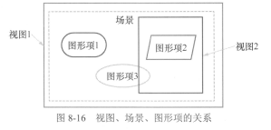

## 第8章 绘图


本章简介：

* 界面上的各个组件都是通过绘图而得到的。

* Qt的二维绘图基本功能是通过QPainter在绘制设备上绘图实现的，通过绘制一些点、线、面等基本图形组成自己需要的图形，得到的图形是不可交互操作的图形。
  * 绘图设备包括：
    * QWidget
    * QPixmap
* Qt还提供了Graphics View框架，使用QGraphicsView、QGraphicsScense、QGraphicsItem类来绘制图形，在一个场景中可以绘制大量图件，且每个图件都是可选择、可交互的。

本章先介绍QPainter绘图的原理，再介绍Graphics View架构

### 8.1 QPainter基本绘图

#### 8.1.1 QPainter绘图系统

##### 1. QPainter与QPaintDevice

Qt的绘图系统使用户可以在屏幕或打印设备上用相同的API绘图，绘图系统基于三个类：

* QPainter

  QPainter用来进行绘图操作的类

* QPaintDevice

  一个可以使用QPainter进行绘图的抽象的二维界面

  一般的绘图设备包括QWidget、QPixmap、QImage等，这些设备为QPainter提供一个"画布"

* QPaintEngine

  给QPainter提供在不同设备上绘图的接口

  QPaintEngine类由QPainter和QPaintDevice内部使用，应用程序一般无需和QPaintEngine打交道，除非要创建自己的设备类型。

##### 2. paintEvent事件和绘图区

要在设备上绘图，只需要重新实现`paintEvent`事件并在上面编写响应代码。创建一个QPainter对象获取绘图设备的接口，然后就可以在绘图设备的"画布"上绘图了。

在`paintEvent()`事件里绘图的基本程序结构是：

```c++
void Widget::paintEvent(QPaintEvent *event)
{
    QPainter painter(this);	//创建与绘图设备关联的QPainter对象
    ...//painter在设备的窗口上画图
}
```

QWidget的绘图区就是其窗口内部区域


QWidget的内部绘图区的坐标系统如图8-1所示

* 坐标系统的单位是像素
* 左上角坐标为(0,0)，向右是X轴正方向，向下是Y轴正方向
* 绘图区的宽度和高度分别由`QWidget::width()`和`QWidget::height()`函数获取。
* 这个坐标系统是QWidget绘图区的局部物理坐标，称为视口（viewport）坐标，相应的还有逻辑坐标，称为窗口（window）坐标

##### 3. QPainter绘图的主要属性

QPainter主要的三个属性：

* pen(QPen对象)

  用于控制线条的颜色、宽度、线型等

* brush(QBrush对象)

  用于设置一个区域的填充特性，可以设置填充颜色、填充方式、渐变特性等，还可以采用图片做材质填充。

* font(QFont对象)

  用于绘制文字时，设置文字的字体样式、大小等属性

> 使用这3个属性基本就控制了绘图的基本特点，当然还有一些其他的功能结合使用，比如叠加模式、旋转和缩放等功能。


==============待完善========================

##### 4. 创建实例

实例`samp8_1`演示:使用`paintEvent()`时间来绘图

#### 8.1.2 QPen的主要功能

#### 8.1.3 QBrush的主要功能

#### 8.1.4 渐变填充

#### 8.1.5 QPainter绘制基本图形元件

### 8.2 坐标系统和坐标变换

#### 8.2.1 坐标变换函数


* QPainter在窗口上绘图的默认坐标系统如图8-1所示，这是绘图设备的物理坐标
* 为了绘图的方便，QPainter提供了一些坐标变换的功能，通过平移、旋转等坐标变换，得到一个逻辑坐标系统

坐标变换函数见表8-5：


* 常用的坐标变换是平移、旋转和缩放
* 使用世界坐标变换矩阵也可以实现这些变换功能，但是需要单独定义一个QTransform类的变量，对于QPainter来说，简单的坐标变换使用QPainter自由的坐标变换函数就足够了。

##### 1. 坐标平移

坐标平移函数`void tanslate(qreal dx, qreal dy)`

* 将坐标系统水平方向平移dx个单位，垂直方向移动dy个单位，在缺少的坐标系统中，单位就是像素。
* 如果是从原始状态平移(dx,dy)，那么平移后的坐标原点就移到了(dx,dy)

举例：假设一个绘图窗口的宽度为300像素，高度为200像素，则其坐标系统如图8-10左所示，若执行平移函数`translate(150,100)`，则坐标系统水平向右平移150像素，平移后的坐标系统如图8-10右所示，坐标原点在窗口的中心，而左上角的坐标变为(-150,-100)，右下角的坐标变为(150,100)。。


##### 2. 坐标旋转

坐标旋转`void rotate(qreal angle)`

* 将坐标系统绕坐标原点顺时针旋转angle角度，单位是度。
* angle为正 顺时针旋转，为负 逆时针旋转

示例：如上图所示，在图8-10右的基础上，若执行`rotate(90)`，则得到图8-11所示的坐标系统。在8-11的新坐标系下，窗口左上角的坐标变成了(-100,150)，而右下角的坐标变成了(100, -150)

> 注：旋转之后并不会改变窗口矩形的实际大小，只是改变了坐标轴的方向。

##### 3. 缩放

缩放函数`void scale(qreal sx, qreal sy)`

sx,sy分别为横向和纵向缩放比例，比例大于1是放大，小于1是缩小。

##### 4. 状态保持与恢复

进行坐标变换时，QPainter内部实际上有一个坐标变换矩形

* `save()`：保存当前坐标状态
* `restore()`：恢复上次保存的坐标状态

这两个函数必须配对使用，操作的是同一个堆栈对象。

* `resetTransform()`：复位所有坐标变换操作，恢复原始的坐标系统。

#### 8.2.2 坐标变换绘图示例

##### 1. 绘制3个五角星的程序

略

##### 2. 绘制五角星的PainterPath的定义

略

#### 8.2.3 视口和窗口

##### 1. 视口和窗口的定义与原理

绘图设备的物理坐标是基本的坐标系，通过QPainter的平移等变换得到更容易操作的逻辑坐标。

为了实现更方便的坐标，QPainter还提供了视口（Viewport）和窗口（Window）坐标系，通过QPainter内部的坐标变换矩阵自动转换为绘图设备的物理坐标。

* 视口

  * 表示绘图设备的任意一个矩形区域的物理坐标，可以只选取物理坐标的一个矩形区域用于绘图。
  * 默认情况下，视口等于绘图设备的整个矩形区。

* 窗口

  * 与视口是同一个矩形，只不过是用逻辑坐标定义的坐标系。

  * 窗口可以直接定义矩形区的逻辑坐标范围。

图8-13是对视口和窗口的图示说明


* 图8-13左图中的矩形框代表绘制设备的物理大小和坐标范围，宽度为300像素，高度为200像素

* 取其中间的一个正方形区域作为视口，灰色的正方形就是视口，绘制设备的物理坐标中，视口的左上角坐标为(50,0)，右下角坐标为(250,200)。
  * 定义此视口，使用`painter.setViewport(50,0,200,200)`
  * 表示从绘制设备物理坐标系统的起点(50,0)开始，取宽度为200、高度为200的一个矩形区域作为视口。
* 对于图8-13左图的视口所表示的正方形区域，定义一个窗口（图8-13右图），窗口坐标的中心在正方形中心，并设置正方形的逻辑边长为100。
  * 定义此窗口，使用`painter.setWindow(-50,-50,100,100)`
  * 它表示对应于视口的矩形区域，其窗口左上角的逻辑坐标是(-50,-50)，窗口宽度为100，高度为100。
  * 这里设置的窗口还是一个正方形，使得从视口到窗口变换时，长和宽的变化比例是相同的。实际可以任意指定窗口的逻辑坐标范围，长和宽的变化比例不相同也是可以的。

##### 2. 视口和窗口的使用实例

略

#### 8.2.4 绘图叠加的效果

略

### 8.3 Graphics View绘图架构

#### 8.3.1 场景、视图与图形项

QPainter绘图：

* 需要在绘图设备的`paintEvent()`事件里编写绘图程序，实现整个绘图过程
* 这种方法绘制的图形是位图
* 这种方法适合用于绘制复杂性不高的固定图形
* 不能实现图件的选择、编辑、拖放等功能。

Graphics View绘图架构：

* 绘制复杂的可交互图像
* 一种基于图形项（Graphics Item）的模型/视图模式
* 使用该架构可以绘制复杂的、有几万个基本图形元件的图形，并且每个图形元件是可选择、可拖放和修改的，类似于矢量绘图软件的绘图功能。



Graphics View架构主要由3个部分组成：

* 场景（Scene）

  场景是不可见的，是一个抽象的管理图形项的容器，可以向场景添加图形项、获取场景中的某个图形项等。场景主要具有如下一些功能：

  * 提供管理大量图形项的快速接口

  * 将事件传播给每个图形项

  * 管理每个图形项的状态，如选择状态、焦点状态等

  * 管理未经变换的渲染功能，主要用于打印

  * 其他：

    * 背景层和前景层

      通常由QBrush指定，也可以通过实现`drawBackground()`和`drawForeground()`函数来实现自定义的背景和前景，实现一些特殊效果。

* 视图（View）

  用于显示场景中的内容，可以为一个场景设置几个视图，用于对同一个数据集提供不同的视口。

  * 视图接受键盘和鼠标输入并转换为场景事件，并进行坐标转换后传送给可视场景。

* 图形项（Graphics Item）

  一些基本的图形元件，图形项的基类是QGraphicsItem。Qt提供了一些基本的图形项，如绘制椭圆的QGraphicsEllipseItem、绘制矩形的QGraphicsRectItem等。

  QGraphicsItem支持如下的一些操作：

  * 支持鼠标事件响应，包括鼠标按下、移动、释放、双击，还有鼠标的停留、滚轮、快捷菜单等事件
  * 支持键盘输入、按键事件
  * 支持拖放操作
  * 支持组合，可以是父子项关系组合，也可以是通过QGraphicsItemGroup类进行组合。
  * 支持碰撞检测

三者的关系：场景是图形项的容器，可以在场景上绘制很多图形项，每个图形项就是一个对象，视图是显示场景的一部分区域的视口，一个场景可以有多个视图，一个视图显示场景的部分区域或全部区域，或从不同角度观察场景。


