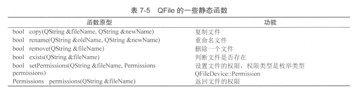
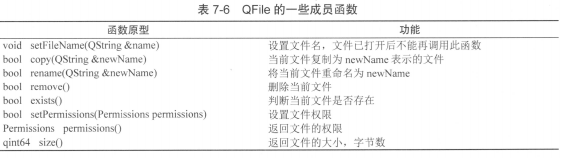

## 第2章 GUI应用程序设计基础

Qt Creator 设计GUI应用程序的基本方法：

* Qt 创建的应用程序项目的基本组织结构
* 可视化设计的UI界面文件的原理和运行机制
* 信号与槽的使用方法
* 窗体可视化设计的底层原理
* 应用程序的窗体、组件布局、菜单、工具栏、Actions等常见设计元素的使用方法

### 2.1 UI文件设计与运行机制

#### 2.1.1 项目文件组成


#### 2.1.2 项目管理文件

#### 2.1.3 界面文件

#### 2.1.4 主函数文件

#### 2.1.5 窗体相关的文件

### 2.2 可视化UI设计

用一个例子说明：

* 布局的管理
* Qt关键的信号与槽的概念

#### 2.2.1 实例程序功能


`samp2_2`：程序的主要功能是对中间一个文本框的文字字体样式和颜色进行设置。

#### 2.2.2 界面组件布局

##### 1. 界面组件的层次关系

使用一些容器类来设计布局，如QGroupBox、QTableWidget、QFrame等。

例如将3个CheckBox组件放置在一个GroupBox组件里：


##### 2. 布局管理

Layouts和Spacers两个布局管理组件


Layouts和Spacers两个组件的功能，如下表所示：


UI设计器工具栏各按钮的功能：


##### 3. 伙伴关系与Tab顺序

伙伴关系（Buddy）是指界面上一个Label和一个组件相关联。伙伴关系是为了在程序运行时，在窗体上用快捷键快速将输入焦点切换到某个组件上。

在UI设计工具栏上单机“Edit Buddies”按钮可以进入伙伴关系编辑状态。单机一个Label，按住鼠标左键，然后拖向一个组件，就建立了Label和组件之间的伙伴关系。

例如，在图`2-9`的界面上，设定“姓名”标签的Text属性为`“姓名（&N）”`，其中符号`&`用来指定快捷字符，界面上并不显示`&`，这里指定快捷字母为N，那么程序运行时，用户按下`Alt+N`，输入焦点就会快速切换到“姓名”关联的输入框内。


#### 2.2.3 信号与槽

信号与槽（Signal & Slot）是Qt编程的基础。

信号（Signal）就是在特定情况下被发射的事件。

槽（Slot）就是对信号响应的函数。

* 槽就是一个函数，与普通函数一样：
  * 可以定义在类的任何部分（public、private 或 protected）
  * 可以具有任何参数
  * 可以被直接调用
* 槽函数与一般的函数不同的是
  * 槽函数可以与一个信号关联，当信号被发射时，关联的槽函数被自动执行

**信号与槽的关联**

信号与槽关联用`QObject::connect()`函数来实现，基本格式是：

`QObject::connect(sender, SIGNAL(signal()), receiver, SLOT(slot()));`

> connect() 是 QObject 类的一个静态函数，而QObject是所有Qt类的基类，在实际调用时可以忽略前面的限定符，所以可以直接写为：`connect(sender, SIGNAL(signal()), receiver, SLOT(slot()));`

* `sender`是发射信号的对象的名称，`signal()`是信号名称。信号可以看作是特殊的函数，需要带括号，有参数时还需要指明参数。

* `receiver`是接收信号的对象名称，`slot()`是槽函数的名称，需要带括号，有参数时还需要指明参数。

* `SIGNAL`和`SLOT`是Qt的宏，用于指明信号和槽，并将它们的参数转换为相应的字符串。

**信号与槽使用的一些规则**

* 一个信号可以连接多个槽
* 多个信号可以连接同一个槽
* 一个信号可以连接另一个信号
* 严格情况下，信号与槽的参数个数和类型需要一致，至少信号的参数不能少于槽的参数。如果不匹配，就会出现编译错误或运行错误。
* 在使用信号与槽的类中，必须在类的定义中加入宏`Q_OBJECT`.
* 当一个信号被发射时，与其关联的槽函数通常被立即执行，就行正常调用一个函数一样。只有当信号关联的所有槽函数执行完毕后，才会执行发射信号处后面的代码。

### 2.4 混合方式UI设计

#### 2.4.5 代码创建其他界面组件

想要实现如图`2-16`所示界面，在工具栏上：

* 增加一个SpinBox用于设置字体大小
* 增加一个FontComboBox来选择字体

不能从设计栏中添加，而需要用代码的方式实现。

具体代码暂时略过。

#### 2.4.6 Action的功能实现

##### 1. 编辑功能 Action 的实现

上述例子中，用于编辑的Action有剪切、复制、粘贴和清除的功能，对应的txtEdit组件也有对应的槽函数，在设计器中，将相应的信号与槽函数进行关联：


##### 2. 其他Action的功能实现

Action的主要信号是`trigger()`和`trigger(bool)`，在单击菜单项或工具栏按钮时发射。

用于设置粗体、斜体和下划线的3个Action具有Checkable属性，选择使用`trigger(bool)`信号设计槽函数更合适。

##### 3. Action的enabled和checked属性的更新

根据当前的状态自动更新相关Action的checked和enable属性。

在本程序中：

* "剪切"、"复制"、"粘贴"的enable属性应该随文本框内文字选择的状态变化而变化。
* "粗体"、"斜体"、"下划线"的checked属性应该随着当前文字的字体状态而自动更新。

QTextEdit有两个可以利用的信号：

* `copyAvailable(bool)`信号在有内容可以被复制时发射，并且传递了一个布尔参数，可以利用此信号来改变actCut、actCopy的enabled属性。
* `selectionChanged()`信号在选择的文字发生变化时发射，利用此信号，可以读取当前文字的格式，从而更新粗体、斜体和下划线3中字体设置Action的checked属性

#### 2.4.7 手工创建的组件的信号与槽

略

#### 2.4.8 为应用程序设置图标

Qt Creator 创建的项目编译后的可执行文件具有默认的图标。

自定义图标：

* 将一个图标文件（必须是".ico"后缀的图标文件）复制到项目源程序目录下

* 在项目配置文件里用`RC_ICONS`设置图标文件名，添加下面一行代码：

  `RC_ICONS = AppIcon.ico`

  其中，"AppIcon.ico"就是复制到项目源程序目录下的图标文件名称。

这样设置后，编译后生成的可执行文件，以及主窗口的图标就换成设置的图标了。

### 2.5 Qt Creator 使用技巧

略

## 第4章 常用界面设计组件

### 4.1 字符串与输入输出

`samp4_1`


​															图4-1：编辑状态时的界面

**QLabel和QLineEdit**

QLabel用于显示字符串，QLineEdit用于显示和输入字符串

这两个类都有两个函数，用于读取和设置显示文字

```cpp
QSting text() const;
void setText(const QString &);
```

**布局**

界面设计使用了布局管理：上方的几个组件是一个GridLayout，下方的9个组件也是一个GridLayout，两个GridLayout，两个GridLayout和中间一个VerticalSpacer又组成一个VerticalLayout。

在布局时，要巧妙运用VerticalSpacer和HorizontalSpacer，还要会设置组件的MaximumSize和MinimumSize属性，已取得期望的布局效果。

例如，在图4-1中，两个GridLayout之间放了一个垂直方向的分隔，当窗体变大时，两个GridLayout的高度并不会发生变化；而如果不放置这个垂直分隔，两个GridLayout的高度都会发生变化，GridLayout内部组件的垂直距离会发生变化。

**普通数值与字符串之间的转换**

略

**进制转换**

略

### 4.1.2 QString 的常用功能


​											图 4-2 QString 函数功能测试实例 `samp4_2`

QString 存储字符串采用的是Unicode码，每个字符是一个16位的QChar，而不是8位的char，所以QString处理中文字符没有问题，而且一个汉字算作是一个字符。

**函数的使用方法**

略

### 4.2 SpinBox的使用


**QSpinBox和QDoubleSpinBox的简介**

* QSpinBox 用于整数的显示和输入，一般显示十进制数，也可以显示二进制、十六进制的数，而且可以在显示框中增加前缀和后缀
* QDoubleSpinBox 用于浮点数的显示和输入，可以设置显示小数位数，也可以设置显示的前缀和后缀。

**QSpinBox和QDoubleSpinBox的主要属性**

QSpinBox和QDoubleSpinBox都是QAbstractSpinBox的子类，具有大多数相同的属性，只是参数不同。

QSpinBox和QDoubleSpinBox的主要属性：


### 4.3 其他数值输入和显示组件


​												图4-4 `samp4_4`的设计界面

在这个实例中，用到如下一些组件：

* QSlider：滚动条，通过滑动来设置数值，可用于数值输入。实例中使用4个滑动条输入红、绿、蓝三色和Alpha值，然后合成颜色，作为一个QTextEdit组件的底色。
* QScrollBar：卷滚条，与QSlider功能类似，还可以用于卷滚区域。
* QProgressBar：进度条，一般用于显示任务进度，可用于数值的百分比显示。实例程序中滑动一个Slider，获取其值并更新ScrollBar和ProgressBar。
* QDial：表盘式数值输入组件，通过转动表针获取输入值。
* QLCDNumber：模仿LCD数字的显示组件，可以显示整数和或浮点数，显示整数时可以不同进制显示。实例程序中转动表盘，获得的值显示在LCD组件中。单机“LCD显示进制”的RadioButton时，设置LCD的显示进制。

**QSlider**

**QScrollBar**

**QDial**

**QProgressBar**

**QLCDNumber**

### 4.4 时间日期与定时器


图4-5 实例 `samp4_5`运行时界面

#### 1. 时间日期相关类

Qt中时间日期类型的类如下：

* QTime：时间数据类型，仅表示时间，如：`15:23:13`
* QDate：日期数据类型，仅表示日期，如：`2017-4-5`
* QDateTime：日期时间数据类型，表示日期和时间，如：`2017-03-23 08:12:43`

Qt中专门用于日期、时间编辑和显示的界面组件：

* QTimeEdit：编辑和显示时间的组件
* QDateEdit：编辑和显示日期的组件
* QDateTimeEdit：编辑和显示日期时间的组件
* QCalendarWidget：一个用日历形式选择日期的组件

QTimer是定时器，用来处理周期性事件的一种对象，类似于硬件定时器。它是直接从QObject类继承而来，不是界面组件类。

#### 2. 日期时间数据与字符串之间的转换

**1. 时间、日期编辑器属性设置**

略

**2. 日期时间数据的获取与转换为字符串**

略

**3. 字符串转换为日期时间**

略

#### 3. QCalendarWidget 日历组件

 #### 4. 定时器的使用

### 4.5 QComboBox 和 QPlainTextEdit


QComboBox 是下拉列表框组件类：

* 它提供一个下拉列表供用户选择
* 每个项（item，或称列表项）还可以关联一个QVariant类型的变量，用于存储一些不可见数据。

QPlainTextEdit 是一个多行文本编辑器，用于显示和编辑多行简单文本。

## 第5章 Model/View 结构

Model/View（模型/视图）结构是Qt中用界面组件显示与编辑数据的一种结构：

* 视图（View）是显示和编辑数据的界面组件。
* 模型（Model）是视图与原始数据之间的接口。

主要的视图组件有：

* QListView、QTreeView和QTableView

主要的模型类：

* QStringListModel
* QStandardItemModel
* 等

第4章介绍的QListWidget、QTreeWidget和QTableWidget分别是这3个类的便利类，它们不适用数据模型，而是将数据直接存储在组件的每个项里。

### 5.1 Model/View 结构

#### Model/View 基本原理


上图各部分的功能如下：

* 数据（Data）是实际的数据，如数据库的一个数据表或SQL查询结果，内存中的一个StringList，或磁盘文件结构等。
* 视图或视图组件（View）是屏幕上的界面组件，视图从数据模型获得每个数据项的模型索引（model index），通过模型索引获取数据，然后为界面组件提供显示数据。
  * Qt 提供了一些现成的数据视图组件，如QListView、QTreeView和QTableView等。
* 模型或数据模型（Model）与实际数据通信，并为视图组件提供数据接口。
  * 它从原始数据提取需要的内容，用于视图组件进行显示和编辑。
  * Qt 中有一些预定义的数据模型，如QStringListModel、QSqlTableModel

* 代理（Delegate）功能可以让用户定制数据的界面显示和编辑方式。在标准的视图组件中，代理功能显示一个数据，当数据被编辑时，代理通过模型索引与数据模型通信，并为编辑数据提供一个编辑器，一般是一个QLineEdit组件。

**模型、视图和代理之间使用信号和槽通信：**

* 当源数据发生变化时，数据模型发射信号通知视图组件
* 当用户在界面上操作数据时，视图组件发射信号表示这些操作信息
* 当编辑数据时，代理发射信号告知数据模型和视图组件编辑器的状态

#### 数据模型

所有基于项数据（item data）的数据模型（Model）都是基于QAbstractItemModel 类的：

* 这个类定义了视图组件和代理存取数据的接口
* 数据无需存储在数据模型里，数据可以是其他类、文件、数据库或任何数据源

Qt中与数据模型相关的几个主要的类的层次结构图：


Qt 提供的数据模型类：


#### 视图组件

视图组件（View）就是显示数据模型的数据的界面组件，Qt提供的视图组件如下：

* QListView：用于显示单列的列表数据，适用于一堆数据的操作。
* QTreeView：用于显示树状结构数据，适用于树状结构数据的操作。
* QTableView：用于显示表格装数据，适用于二维表格型数据的操作。
* QColumnView：用多个QListView 显示树状层次结构，树状结构的一层用一个QListView显示。
* QHeaderView：提供行表头或列表头的视图组件，如QTableView的行表头和列表头。

视图组件在显示数据时，只需调用视图类的`setModel()`函数，为视图组件设置一个数据模型就可以实现视图组件与数据模型之间的关联，在视图组件上的修改将自动保存到关联的数据模型里，一个数据模型可以同时在多个视图组件里显示数据。

视图类的层次结构：


#### 代理

代理（Delegate）就是在视图组件上为编辑数据提供编辑器。

* 作用
  * 如在表格组件中编辑一个单元格的数据时，代理负责从数据模型获取相应的数据，然后显示在编辑器里，修改数据后，又将其保存到数据模型中。

* 继承结构
  * QAbstractItemDelegate：是所有代理类的基类，作为抽象类，它不能直接使用。
  * 它的一个子类QStyledItemDelegate，是Qt的视图组件缺省使用的代理类。
* 编辑数据时，缺省使用的是QLlineEdit编辑框，对于不同的数据编辑需求，如只允许输入整型数，使用一个QSpinBox作为代理组件更恰当，这时，可以从QStyledItemDelegate集成创建自定义代理类。

#### Model/View 结构的一些概念

**1. Model/View 的基本结构**

在Model/View 结构中，数据模型为视图组件和代理提供存取数据的标准接口。

所有的数据模型类都从QAbstractItemModel 继承而来，不管底层的数据结构是如何组织数据的，QAbstractItemModel 的子类都以表格的层次结构表示数据，视图组件通过这种规则来存取模型中的数据，但是表现给用户的形式不一样。


* 不管数据模型的表现形式如何，数据模型中存储数据的基本单元都是项（item），每个项都有一个行号、一个列号，还有一个父项（parent item）。
  * 在列表和表格模式下，所有的项都有一个相同的顶层项（root item）。
  * 在树状结构中，行号、列号、父项稍微复杂一点，但是由这3个参数完全可以定义一个项的位置。

**2. 模型索引**

为保证数据的表示与数据存取方式隔离，数据模型中引入了模型索引（model index）的概念。

* 每个数据项都有一个模型索引，视图组件和代理都通过模型索引来获取数据。
* QModelIndex 表示模型索引的类。
  * 模型索引提供数据存取的一个临时指针，用于数据的提取或修改。
  * 该模型索引是临时的，如果需要使用持久性的模型索引，使用QPersistentModelIndex类。

**3. 行号和列号**

* 数据模型的基本形式是用行和列定义的表格数据，但这并不意味着底层的数据是用二维数据存储的。
* 使用3个参数：行号、列号、父项来获取模型索引。

* `图5-4`的表格数据模型中的3个数据项A、B、C，获取器模型的代码是：

  ```c++
  QModelIndex indexA = model->index(0, 0, QModelIndex());
  QModelIndex indexB = model->index(1, 1, QModelIndex());
  QModelIndex indexC = model->index(2, 1, QModelIndex());
  ```

* 对于列表和表格模式的数据模型，顶层节点总是用`QModelIndex()`表示

**4. 父项**

* 当数据模型是列表或表格时，所有数据项的父项（parent item）就是顶层项。

* 当数据模型是树状结构时，在构造数据项的模型索引时，必须指定正确的行号、列号和父节点

  `图5-4`中的树状数据模型，A、B、C节点的模型索引：

  ```c++
  QModelIndex indexA = model->index(0, 0, QModelIndex());
  QModelIndex indexC = model->index(2, 1, QModelIndex());
  QModelIndex indexC = model->index(1, 0, indexA);
  ```

**5. 项的角色**

在为数据模型的一个项设置数据时，可以赋予其不同项的角色（item role）的数据。

```c++
void QStandardItem::setData(const QVariant &value, int role=Qt::UserRole+1);
```

role是设置数据的角色，一个项可以有不同角色的数据，用于不同的场合。

role是`Qt::ItemDataRole`枚举类型：

* `Qt::DisplayRole` 角色是在视图组件中显示的字符串
* `Qt::ToolTipRole` 是鼠标提示消息
* `Qt::UserRole` 可以自定义数据

项的标准角色是`Qt::DisplayRole`


为一个项的不同角色定义数据，可以告知视图组件和代理组件如何显示数据。

例如，在`图5-5`中:

* 项的DisplayRole数据是显示的字符串
* DecorationRle 是用于装饰显示的属性
* ToolTipRole定义了鼠标提示信息。

不同的视图组件对各种角色的解释和显示可能不一样，也可能忽略某些角色的数据。


## 第7章 文件系统和文件读写

本章主要介绍：

* 如何实现文本文件、二进制文件的读写
* 文件和目录的管理功能

### 7.1 文本文件读写

文本文件是指以纯文本格式存储的文件。

Qt提供了两种读写纯文本文件的基本方法：

* 用QFile类的IODevice读写功能直接进行读写
* 利用QFile和QTextStream结合起来，用流（stream）的方法进行文件读写

示例：`samp7_1`演示了两种方法读写文本文件：


#### QFile读写文本文件

**使用`QFile`读文件**

```c++
bool MainWindow::openTextByIODevice(const QString &aFileName)
{//用IODevice方式打开文本文件
    QFile   aFile(aFileName);
//    aFile.setFileName(aFileName);

    if (!aFile.exists()) //文件不存在
        return false;

    if (!aFile.open(QIODevice::ReadOnly | QIODevice::Text))
        return false;

    ui->textEditDevice->setPlainText(aFile.readAll());
    aFile.close();

    ui->tabWidget->setCurrentIndex(0);
    return  true;
}
```

`QFile::open()`函数需传递一个`QIODevice::OpenModeFlag`枚举类型的参数，主要取值如下：

* `QIODevice::ReadOnly`：以只读方式打开文件，用于载入文件。
* `QIODevice::WriteOnly`：以只写方式打开文件，用于保存文件。（隐含着`Truncate`，即删除文件原有内容）
* `QIODevice::ReadWrite`：以读写方式打开。
* `QIODevice::Append`：以添加模式打开，新写入文件的数据添加到文件尾部。
* `QIODevice::Truncate`：以截取方式打开文件，文件原有的内容全部被删除。
* `QIODevice::Text`：以文本方式打开文件，读取时"\n"被自动翻译为换行符，写入时字符串结束符会自动翻译为系统平台的编码，如Windows平台下是"\r\n"。

逐行读取的方式：

```c++
bool MainWindow::openTextByIODevice(const QString &aFileName)
{//用IODevice方式打开文本文件
    QFile   aFile(aFileName);
//    aFile.setFileName(aFileName);

    if (!aFile.exists()) //文件不存在
        return false;

    if (!aFile.open(QIODevice::ReadOnly | QIODevice::Text))
        return false;

    ui->textEditDevice->clear();
    while (!aFile.atEnd())
    {
        QByteArray line = aFile.readLine();//自动添加 \n
        QString str=QString::fromLocal8Bit(line); //从字节数组转换为字符串
        str.truncate(str.length()-1); //去除结尾增加的空行
        ui->textEditDevice->appendPlainText(str);
    }
    aFile.close();

    ui->tabWidget->setCurrentIndex(0);
    return  true;
}
```

**使用`QFile`保存文件：**

```c++
bool MainWindow::saveTextByIODevice(const QString &aFileName)
{ //用IODevice方式保存文本文件
    QFile   aFile(aFileName);
//    aFile.setFileName(aFileName);

    if (!aFile.open(QIODevice::WriteOnly | QIODevice::Text))
        return false;

    QString str=ui->textEditDevice->toPlainText();//整个内容作为字符串

    QByteArray  strBytes=str.toUtf8();//转换为字节数组
//    QByteArray  strBytes=str.toLocal8Bit();

    aFile.write(strBytes,strBytes.length());  //写入文件

    aFile.close();
    ui->tabWidget->setCurrentIndex(0);
    return  true;
}
```

#### QFile 和 QTextStream 结合读写文本文件

QTextStream与IO读写设备结合，为数据读写提供了一些方便的方法的类。

QTextStream可以与QFile、QTemporaryFile、QBuffer、QTcpSocket和QUdpSocket等IO设备结合使用。

**QFile与QTextStream结合读取文件**

```c++
bool MainWindow::openTextByStream(const QString &aFileName)
{ //用 QTextStream打开文本文件
    QFile   aFile(aFileName);
    if (!aFile.exists()) //文件不存在
        return false;

    if (!aFile.open(QIODevice::ReadOnly | QIODevice::Text))
        return false;

    QTextStream aStream(&aFile); //用文本流读取文件
    aStream.setAutoDetectUnicode(true); //自动检测Unicode,才能正常显示文档内的汉字

    ui->textEditStream->setPlainText(aStream.readAll());

    aFile.close();//关闭文件
    ui->tabWidget->setCurrentIndex(1);
    return  true;
}

```

逐行读取的方式：

```c++
bool MainWindow::openTextByStream(const QString &aFileName)
{ //用 QTextStream打开文本文件
    QFile   aFile(aFileName);

    if (!aFile.exists()) //文件不存在
        return false;

    if (!aFile.open(QIODevice::ReadOnly | QIODevice::Text))
        return false;

    QTextStream aStream(&aFile); //用文本流读取文件
    aStream.setAutoDetectUnicode(true); //自动检测Unicode,才能正常显示文档内的汉字

    ui->textEditStream->clear();//清空
    while (!aStream.atEnd())
    {
        str=aStream.readLine();//读取文件的一行
        ui->textEditStream->appendPlainText(str); //添加到文本框显示
    }

    aFile.close();//关闭文件
    ui->tabWidget->setCurrentIndex(1);
    return  true;
}
```


**QFile与QTextStream结合写文件**

```c++
bool MainWindow::saveTextByStream(const QString &aFileName)
{//用QTextStream保存文本文件
    QFile   aFile(aFileName);
    if (!aFile.open(QIODevice::WriteOnly | QIODevice::Text))
        return false;

    QTextStream aStream(&aFile); //用文本流读取文件
    aStream.setAutoDetectUnicode(true); //自动检测Unicode,才能正常显示文档内的汉字

    QString str=ui->textEditStream->toPlainText(); //转换为字符串

    aStream<<str; //写入文本流

    aFile.close();//关闭文件
    return  true;
}
```

#### 解决中文乱码的问题

* 使用`QTextStream`读写中文内容的文本文件时，需调用`setAutoDetectUnicode(true)`才能正确识别Unicode吗，不然读取的中文将是乱码的。

* 也可以在应用中做全局的设置

  ```c++
  int main(int argc, char *argv[])
  {
  	//解决汉字乱码问题
      QTextCodec *codec = QTextCodec::codecForName("UTF-8");
      QTextCodec::setCodecForLocale(codec); //解决汉字乱码问题
  
      QApplication a(argc, argv);
      MainWindow w;
      w.show();
  
      return a.exec();
  }
  ```


### 7.2 二进制文件读写

Qt 使用 QFile 和 QDataStream 进行二进制数据文件的读写：

* QFile 负责文件的IO设备接口，即与文件的物理交互。
* QDataStream 以数据流的方式读取文件内容或写入文件内容。

实例：`samp7_2`演示二进制文件的读写：

以表格的形式编辑一个数据表，采用`Model/View`结构，编辑后的数据保存为二进制文件。


根据QDataStream保存文件时使用的数据编码的方式不同，可以保存为两种文件：

* 用Qt 预定义编码保存各种类型数据的文件，定义文件后缀为“.stm”。
  * Qt 写入某种类型数据时用了Qt预定义的标记符，读出数据时，根据标记符读取数据。
* 编制编码数据文件，定义文件后缀为“.dat”。
  * 在将数据写到文件时，完全使用数据的二进制原始内容，每个字节都有具体的定义，在读出数据时，只需根据每个字节的定义读取数据即可。

#### Qt 预定义编码文件的读写

**1. 保存为 stm 文件**

```c++
bool MainWindow::saveDataAsStream(QString &aFileName)
{//将模型数据保存为Qt预定义编码的数据文件
    QFile aFile(aFileName);  //以文件方式读出
    if (!(aFile.open(QIODevice::WriteOnly | QIODevice::Truncate)))
        return false;

    QDataStream aStream(&aFile);
    aStream.setVersion(QDataStream::Qt_5_9); //设置版本号，写入和读取的版本号要兼容

    qint16  rowCount=theModel->rowCount(); //数据模型行数
    qint16  colCount=theModel->columnCount(); //数据模型列数

    aStream<<rowCount; //写入文件流，行数
    aStream<<colCount;//写入文件流，列数

//获取表头文字
    for (int i=0;i<theModel->columnCount();i++)
    {
        QString str=theModel->horizontalHeaderItem(i)->text();//获取表头文字
        aStream<<str; //字符串写入文件流，Qt预定义编码方式
    }


//获取数据区的数据
    for (int i=0;i<theModel->rowCount();i++)
    {
        QStandardItem* aItem=theModel->item(i,0); //测深
        qint16 ceShen=aItem->data(Qt::DisplayRole).toInt();
        aStream<<ceShen;// 写入文件流，qint16

        aItem=theModel->item(i,1); //垂深
        qreal chuiShen=aItem->data(Qt::DisplayRole).toFloat();
        aStream<<chuiShen;//写入文件流， qreal

        aItem=theModel->item(i,2); //方位
        qreal fangWei=aItem->data(Qt::DisplayRole).toFloat();
        aStream<<fangWei;//写入文件流， qreal

        aItem=theModel->item(i,3); //位移
        qreal weiYi=aItem->data(Qt::DisplayRole).toFloat();
        aStream<<weiYi;//写入文件流， qreal

        aItem=theModel->item(i,4); //固井质量
        QString zhiLiang=aItem->data(Qt::DisplayRole).toString();
        aStream<<zhiLiang;// 写入文件流，字符串

        aItem=theModel->item(i,5); //测井
        bool quYang=(aItem->checkState()==Qt::Checked);
        aStream<<quYang;// 写入文件流，bool型
    }
    aFile.close();
    return true;
}
```

* 在开始写数据流之前，使用`setVersion()`函数为 QDataStream 对象设置版本号。

  > 以 Qt 的预定义类型编码保存的文件需指定流版本号，因为每个版本的 Qt 对数据类型的编码可能有差别，需要保证写文件和读文件的版本是兼容（流版本号一样，或读取文件的流版本号高于写文件时的流版本号）的。

**stm 文件格式**

根据上面的代码，可知该示例的stm文件格式定义如下：


从表可知stm文件的数据存储顺序和类型，但是并不知道这些类型的存储方式，读文件时，只需按照上表的顺序和类型读取数据即可。

**3. 读取 stm 文件**

```c++
bool MainWindow::openDataAsStream(QString &aFileName)
{ //从Qt预定义流文件读入数据
    QFile aFile(aFileName);  //以文件方式读出
    if (!(aFile.open(QIODevice::ReadOnly)))
        return false;

    QDataStream aStream(&aFile); //用文本流读取文件
    aStream.setVersion(QDataStream::Qt_5_9); //设置流文件版本号

    qint16  rowCount,colCount;
    aStream>>rowCount; //读取行数
    aStream>>colCount; //列数

    this->resetTable(rowCount); //表格复位

    //获取表头文字
    QString str;
    for (int i=0;i<colCount;i++)
        aStream>>str;  //读取表头字符串

    //获取数据区文字，
    qint16  ceShen;
    qreal  chuiShen;
    qreal  fangWei;
    qreal  weiYi;
    QString  zhiLiang;
    bool    quYang;
    QStandardItem   *aItem;
    QModelIndex index;

    for (int i=0;i<rowCount;i++)
    {
        aStream>>ceShen;//读取测深, qint16
        index=theModel->index(i,0);
        aItem=theModel->itemFromIndex(index);
        aItem->setData(ceShen,Qt::DisplayRole);

        aStream>>chuiShen;//垂深,qreal
        index=theModel->index(i,1);
        aItem=theModel->itemFromIndex(index);
        aItem->setData(chuiShen,Qt::DisplayRole);


        aStream>>fangWei;//方位,qreal
        index=theModel->index(i,2);
        aItem=theModel->itemFromIndex(index);
        aItem->setData(fangWei,Qt::DisplayRole);


        aStream>>weiYi;//位移,qreal
        index=theModel->index(i,3);
        aItem=theModel->itemFromIndex(index);
        aItem->setData(weiYi,Qt::DisplayRole);


        aStream>>zhiLiang;//固井质量,QString
        index=theModel->index(i,4);
        aItem=theModel->itemFromIndex(index);
        aItem->setData(zhiLiang,Qt::DisplayRole);

        aStream>>quYang;//bool
        index=theModel->index(i,5);
        aItem=theModel->itemFromIndex(index);
        if (quYang)
            aItem->setCheckState(Qt::Checked);
        else
            aItem->setCheckState(Qt::Unchecked);
    }

    aFile.close();
    return true;
}
```

使用Qt预定义编码的方式读写文件的特点如下：

* 读写操作都比较方便，支持读写各种数据类型，包括 Qt 的一些类，还可以为流数据读写扩展自定义的数据类型。
* 写文件和读文件时必须保证使用的流版本兼容。
* 读写都需采用Qt预定义的编码，其他编程语言来读取文件时会有问题。

#### 标准编码文件的读写

**1. 保持为dat文件**

以标准编码的方式创建文件，使文件的每个字节都有具体的定义，用户在读取这种文件时，按照文件格式定义读取每个字节数据并做出解析即可。

保持dat文件的代码：

```c++
bool MainWindow::saveBinaryFile(QString &aFileName)
{ //保存为纯二进制文件
    QFile aFile(aFileName);  //以文件方式读出
    if (!(aFile.open(QIODevice::WriteOnly)))
        return false;

    QDataStream aStream(&aFile); //用文本流读取文件
//    aStream.setVersion(QDataStream::Qt_5_9); //无需设置数据流的版本
    aStream.setByteOrder(QDataStream::LittleEndian);//windows平台
//    aStream.setByteOrder(QDataStream::BigEndian);//QDataStream::LittleEndian

    qint16  rowCount=theModel->rowCount();
    qint16  colCount=theModel->columnCount();

    aStream.writeRawData((char *)&rowCount,sizeof(qint16)); //写入文件流
    aStream.writeRawData((char *)&colCount,sizeof(qint16));//写入文件流

//获取表头文字
    QByteArray  btArray;
    QStandardItem   *aItem;
    for (int i=0;i<theModel->columnCount();i++)
    {
        aItem=theModel->horizontalHeaderItem(i); //获取表头item
        QString str=aItem->text(); //获取表头文字
        btArray=str.toUtf8(); //转换为字符数组
        aStream.writeBytes(btArray,btArray.length()); //写入文件流,长度uint型，然后是字符串内容
    }

//获取数据区文字，
    qint8   yes=1,no=0; //分别代表逻辑值 true和false
    for (int i=0;i<theModel->rowCount();i++)
    {
        aItem=theModel->item(i,0); //测深
        qint16 ceShen=aItem->data(Qt::DisplayRole).toInt();//qint16类型
        aStream.writeRawData((char *)&ceShen,sizeof(qint16));//写入文件流

        aItem=theModel->item(i,1); //垂深
        qreal chuiShen=aItem->data(Qt::DisplayRole).toFloat();//qreal 类型
        aStream.writeRawData((char *)&chuiShen,sizeof(qreal));//写入文件流

        aItem=theModel->item(i,2); //方位
        qreal fangWei=aItem->data(Qt::DisplayRole).toFloat();
        aStream.writeRawData((char *)&fangWei,sizeof(qreal));

        aItem=theModel->item(i,3); //位移
        qreal weiYi=aItem->data(Qt::DisplayRole).toFloat();
        aStream.writeRawData((char *)&weiYi,sizeof(qreal));

        aItem=theModel->item(i,4); //固井质量
        QString zhiLiang=aItem->data(Qt::DisplayRole).toString();
        btArray=zhiLiang.toUtf8();
        aStream.writeBytes(btArray,btArray.length()); //写入长度,uint，然后是字符串
//        aStream.writeRawData(btArray,btArray.length());//对于字符串，应使用writeBytes()函数

        aItem=theModel->item(i,5); //测井取样
        bool quYang=(aItem->checkState()==Qt::Checked); //true or false
        if (quYang)
            aStream.writeRawData((char *)&yes,sizeof(qint8));
        else
            aStream.writeRawData((char *)&no,sizeof(qint8));
    }

    aFile.close();
    return true;
}
```

说明：

* 字节序

  如果有必要需要为文件指定字节序，大端字节序或小端字节序。

* `writeRawData()`函数

  `int QDataStream::writeRawData(const char* s, int len)`

  s是一个指向字节型数据的指针，len是字节数据的长度。调用该函数会向文件流连续写入len个字节的数据，这些数据保存在指针s指向的起始地址里。

* `writeBytes()`函数

  `QDataStream &QDataStream::writeBytes(const char* s, uint len)`

  s是一个指向字节型数据的指针，len是字节数据的长度。`writeBytes()`在写入数据时，会先将len作为一个quint32类型写入数据流，然后再写入len个从指针s获取的数据。

  该函数适合于写入字符串数据，因为在写入字符串之前要先写入字符串的长度。

  对于的读取函数为`readBytes()`，它可以自动读取长度和内容。

**dat 文件格式**

上面代码保存的dat文件格式如下：


**读取dat文件**

```c++
bool MainWindow::openBinaryFile(QString &aFileName)
{//打开二进制文件
    QFile aFile(aFileName);  //以文件方式读出
    if (!(aFile.open(QIODevice::ReadOnly)))
        return false;

    QDataStream aStream(&aFile); //用文本流读取文件
//    aStream.setVersion(QDataStream::Qt_5_9); //设置数据流的版本
    aStream.setByteOrder(QDataStream::LittleEndian);
//    aStream.setByteOrder(QDataStream::BigEndian);

    qint16  rowCount,colCount;
    aStream.readRawData((char *)&rowCount, sizeof(qint16));
    aStream.readRawData((char *)&colCount, sizeof(qint16));

    this->resetTable(rowCount);


    //获取表头文字,但是并不利用
    char *buf;
    uint strLen;  //也就是 quint32
    for (int i=0;i<colCount;i++)
    {
        aStream.readBytes(buf,strLen);//同时读取字符串长度，和字符串内容
        QString str=QString::fromLocal8Bit(buf,strLen); //可处理汉字
    }

//获取数据区数据
    QStandardItem   *aItem;

    qint16  ceShen;
    qreal  chuiShen;
    qreal  fangWei;
    qreal  weiYi;
    QString  zhiLiang;
    qint8   quYang; //分别代表逻辑值 true和false
    QModelIndex index;

    for (int i=0;i<rowCount;i++)
    {
        aStream.readRawData((char *)&ceShen, sizeof(qint16)); //测深
        index=theModel->index(i,0);
        aItem=theModel->itemFromIndex(index);
        aItem->setData(ceShen,Qt::DisplayRole);

        aStream.readRawData((char *)&chuiShen, sizeof(qreal)); //垂深
        index=theModel->index(i,1);
        aItem=theModel->itemFromIndex(index);
        aItem->setData(chuiShen,Qt::DisplayRole);

        aStream.readRawData((char *)&fangWei, sizeof(qreal)); //方位
        index=theModel->index(i,2);
        aItem=theModel->itemFromIndex(index);
        aItem->setData(fangWei,Qt::DisplayRole);

        aStream.readRawData((char *)&weiYi, sizeof(qreal)); //位移
        index=theModel->index(i,3);
        aItem=theModel->itemFromIndex(index);
        aItem->setData(weiYi,Qt::DisplayRole);

        aStream.readBytes(buf,strLen);//固井质量
        zhiLiang=QString::fromLocal8Bit(buf,strLen);
        index=theModel->index(i,4);
        aItem=theModel->itemFromIndex(index);
        aItem->setData(zhiLiang,Qt::DisplayRole);

        aStream.readRawData((char *)&quYang, sizeof(qint8)); //测井取样
        index=theModel->index(i,5);
        aItem=theModel->itemFromIndex(index);
        if (quYang==1)
            aItem->setCheckState(Qt::Checked);
        else
            aItem->setCheckState(Qt::Unchecked);
    }

    aFile.close();
    return true;
}
```

### 7.3 文件目录操作

#### 文件目录操作相关的类

Qt 提供的与文件和目录操作相关的类包括以下几个：

* QCoreApplication: 用于提取应用程序路径、程序名等文件信息。
* QFile: 除了打开文件操作外，QFile 还有复制文件、删除文件等功能。
* QFileInfo: 用于提取文件的信息，包括路径、文件名、后缀等。
* QDire: 用于提取目录或文件信息，获取一个目录下的文件或目录列表，创建或删除目录和文件，文件重命名等操作。
* QTemporaryDir 和 QTemporaryFile: 用于创建临时目录和临时文件。
* QFileSystemWatcher: 文件和目录监听类，监听目录下文件的添加、删除等变化，监听文件修改变化。

#### 实例概述

实例`samp7_3`演示前述各种目录与文件操作类的主要功能


在按钮被单击时，先显示按钮的标题和ToolTip信息，以便明显的知道按钮演示的功能，例如：`baseName()`按钮的`clicked()`操函数代码如下：

```c++
void Dialog::showBtnInfo(QObject *btn)
{ //显示btn的信息
    QPushButton *theBtn =static_cast<QPushButton*>(btn);
    ui->plainTextEdit->appendPlainText(theBtn->text());
    ui->plainTextEdit->appendPlainText(theBtn->toolTip()+"\n");
}

void Dialog::on_pushButton_30_clicked()
{//QFileInfo.basename()
    showBtnInfo(sender());
    QFileInfo  fileInfo(ui->editFile->text());
    QString  str=fileInfo.baseName();
    ui->plainTextEdit->appendPlainText(str+"\n");
}
```

#### QCoreApplication 类

* QCoreApplication 是为无GUI应用提供事件循环的类，是所有应用程序类的基类。
* QCoreApplication 的子类 QGuiApplication 为有GUI界面的应用程序提供流控制和主要的设定
* QGuiApplication 的子类 QApplication 为基于 QWidget 的应用程序提供支持，包括界面的初始化等。

QCoreApplication 提供的有用函数：


#### QFile 类

QFile 分别提供了静态函数和成员函数用于文件操作：






#### QFileInfo 类

QFileInfo 类的接口函数提供文件的各种信息。


#### QDir 类

QDir 是进行目录操作的类


#### QTemporaryDir 和 QTemporaryFile

QTemporaryDir 是用于创建、删除临时目录的类。


* QTemporaryDir
  * 在系统临时目录，即 `QDir::tempPath` 目录下创建一个临时目录，临时目录名称为 `QCoreApplication:: applicationName()`为前缀，后加6个字符。
  * 临时目录可设置为使用完后自动删除，即临时目录变量删除时，临时目录也删除。
* QTemporaryFile 用于创建临时文件的类，临时文件保存在临时目录下。
  * 临时目录以`QCoreApplication::applicationName()`作为文件名，以`XXXXXX`6个随机数字作为文件后缀。
  * 可设置是否自动删除临时文件。
  * `QTemporary::open()`函数用于打开临时文件，只有打开临时文件，才实际创建了此文件。

#### QFileSystemWatcher 类

QFileSystemWatcher 是对目录和文件进行监听的类。

把某些目录或文件添加到 QFileSystemWatcher 对象的监听列表后，当目录下发生文件新建、删除等操作时会发射`directoryChanged()`信号，当监听的文件发生修改、重命名等操作时，会发射 `fileChanged()`信号。所以，这个类在进行目录或文件监听时起作用。

**QFileSystemWatcher  的主要接口函数：**


**QFileSystemWatcher 的两个信号，分别是目录变化和文件变化时发射的信号**

```c++
void QFileSystemWatcher::directoryChanged(const QString &path)
void QFileSystemWatcher::fileChanged(const QString &path)
```


## 第8章 绘图


本章简介：

* 界面上的各个组件都是通过绘图而得到的。

* Qt的二维绘图基本功能是通过QPainter在绘制设备上绘图实现的，通过绘制一些点、线、面等基本图形组成自己需要的图形，得到的图形是不可交互操作的图形。
  * 绘图设备包括：
    * QWidget
    * QPixmap
* Qt还提供了Graphics View框架，使用QGraphicsView、QGraphicsScense、QGraphicsItem类来绘制图形，在一个场景中可以绘制大量图件，且每个图件都是可选择、可交互的。

本章先介绍QPainter绘图的原理，再介绍Graphics View架构

### 8.1 QPainter基本绘图

#### 8.1.1 QPainter绘图系统

##### 1. QPainter与QPaintDevice

Qt的绘图系统使用户可以在屏幕或打印设备上用相同的API绘图，绘图系统基于三个类：

* QPainter

  QPainter用来进行绘图操作的类

* QPaintDevice

  一个可以使用QPainter进行绘图的抽象的二维界面

  一般的绘图设备包括QWidget、QPixmap、QImage等，这些设备为QPainter提供一个"画布"

* QPaintEngine

  给QPainter提供在不同设备上绘图的接口

  QPaintEngine类由QPainter和QPaintDevice内部使用，应用程序一般无需和QPaintEngine打交道，除非要创建自己的设备类型。

##### 2. paintEvent事件和绘图区

要在设备上绘图，只需要重新实现`paintEvent`事件并在上面编写响应代码。创建一个QPainter对象获取绘图设备的接口，然后就可以在绘图设备的"画布"上绘图了。

在`paintEvent()`事件里绘图的基本程序结构是：

```c++
void Widget::paintEvent(QPaintEvent *event)
{
    QPainter painter(this);	//创建与绘图设备关联的QPainter对象
    ...//painter在设备的窗口上画图
}
```

QWidget的绘图区就是其窗口内部区域


QWidget的内部绘图区的坐标系统如图8-1所示

* 坐标系统的单位是像素
* 左上角坐标为(0,0)，向右是X轴正方向，向下是Y轴正方向
* 绘图区的宽度和高度分别由`QWidget::width()`和`QWidget::height()`函数获取。
* 这个坐标系统是QWidget绘图区的局部物理坐标，称为视口（viewport）坐标，相应的还有逻辑坐标，称为窗口（window）坐标

##### 3. QPainter绘图的主要属性

QPainter主要的三个属性：

* pen(QPen对象)

  用于控制线条的颜色、宽度、线型等

* brush(QBrush对象)

  用于设置一个区域的填充特性，可以设置填充颜色、填充方式、渐变特性等，还可以采用图片做材质填充。

* font(QFont对象)

  用于绘制文字时，设置文字的字体样式、大小等属性

> 使用这3个属性基本就控制了绘图的基本特点，当然还有一些其他的功能结合使用，比如叠加模式、旋转和缩放等功能。

##### 4. 创建实例

实例`samp8_1`演示:使用`paintEvent()`事件来绘制一个矩形

```c++
QPainter painter(this);
painter.setRenderHint(QPainter::Antialiasing);		// 反走样
painter.setRenderHint(QPainter::TextAntialiasing);	// 抗锯齿

int w = this->width();
int h = this->height();
QRect rect(w/4, h/4, w/2, h/2);	// 要绘制的矩形框

// 设置画笔
QPen pen;
pen.setWidth(3);	//线宽
pen.setColor(Qt::red);	//线颜色
pen.setStyle(Qt::SolidLine);	//线的类型，实线或虚线等
pen.setCapStyle(Qt::FlatCap);	//线的端点样式
pen.setJoinStyle(Qt::BevelJoin);	//线的连接点样式
painter.setPen(pen);

// 设置画刷
QBrush brush;
brush.setColor(Qt::yellow);	// 画刷颜色
brush.setStyle(Qt::SolidPattern);	// 画刷填充样式
painter.setBrush(brush);

painter.drawRect(rect);	// 绘制图形
```

#### 8.1.2 QPen的主要功能

QPen用于绘图时，对线条进行设置。

主要包括：

* 线宽
* 颜色
* 线型 等

`表8-1`是 QPen 类的主要接口函数

> 通常一个设置函数都有一个对应的读取函数。
>
> 如 setColor() 用于设置画笔颜色，对应的读取画笔颜色的函数为 color()


除了线条颜色和宽度的设置，QPen影响线条的另外3个主要属性：

* 线条样式（style）
* 端点样式（capStyle）
* 连接样式（joinStyle）

**1. 线条样式**

`setStyle(Qt::PenStyle style)`

Qt 定义的几种线条样式：


也可以自定义线条样式（需要用到 `setDashOffset()`和`setDashPattern()`函数）

**2. 线条端点样式**

`setCapStyle(Qt::PenCapStyle style)`

Qt dinginess的几种线条端点样式：


**3. 线条连接样式**

`setJoinStyle(Qt::PenJoinStyle style)`

Qt 定义的几种线条连接样式：


#### 8.1.3 QBrush的主要功能

QBrush 定义了 QPainter 绘图时的填充特性，包括：

* 填充颜色
* 填充样式
* 材质填充时的材质图片等

主要函数见`表 8-2`


**设置画刷样式**

`setStyle(Qt::BrushStyle style)` 用于设置画刷样式。

参数是`Qt::BrushStyle`枚举，该枚举类型典型的几种取值见 `表8-3`


渐变填充需要使用专门的类作为Brush赋值给QPainter。

下面是`Qt::BrushStyle` 几种样式填充


实例：`samp8_1`

用材质图片填充一个矩形

```c++
QPainter painter(this);
painter.setRenderHint(QPainter::Antialiasing);	// 反走样
painter.setRenderHint(QPainter::TextAntialiasing);	// 抗锯齿

int w = this->width();
int h = this->height();
QRect rect(w/4, h/4, w/2, h/2);	//要绘制的矩形

QPen pen;
pen.setWidth(3);	// 线宽
pen.setColor(Qt::red);	// 线颜色
pen.setStyle(Qt::SolidLine);		// 线的类型
pen.setCapStyle(Qt::FlatCap);		// 线的端点样式
pen.setJoinStyle(Qt::BevelJoin);	// 线的连接点样式
painter.setPen(pen);

// 设置画刷
QPixmap texturePixmap(":images/images/texture.jpg");

QBrush brush;
brush.setStyle(Qt::TexturePattern); // 设置填充样式
brush.setTexture(texturePixmap); // 设置材质图片
painter.setBrush(brush);

painter.drawRect(rect);	// 绘制图形
```

#### 8.1.4 渐变填充

<font color=red>使用渐变填充需要用渐变类的对象作为Painter的brush。</font>

**有3个实现渐变填充的类：**

* `QLinearGradient`：线性渐变。指定一个起点及其颜色，终点及其颜色，还可以指定中间的某个颜色点的颜色。起点至终点之间的颜色会线性插值计算，得到线性渐变的填充颜色。
* `QRadialGradient`：有简单辐射渐变和扩展辐射渐变两种方式。简单辐射渐变是在一个圆内的一个焦点和一个端点之间生成渐变颜色，扩展辐射渐变是在一个焦点圆和一个中心圆之间生成渐变色。
* `QConicalGradient`：圆锥型渐变，围绕一个中心点逆时针生成渐变颜色。


**设置延展方式**

用`QGradient`类的`setSpread(QGradient::Spread methodd)`函数设置延展方式。

3种延展方式的效果：

* `PadSpread` 模式是用结束点的颜色填充外部区域，这是缺省的方式。
* `RepeatSpread` 模式是重复使用渐变方式填充外部区域。
* `ReflectSpread` 是反射式重复使用渐变方式填充外部区域。

> `setSpread()` 对圆锥形渐变不起作用

 

**实例：渐变效果绘图**


```c++
QPainter painter(this);
int w = this->width();
int h = this->height();
QRect rect(w/4, h/4, w/2, h/2);	// 中间区域矩形框
// 径向渐变
QRadialGradient radialGrad(w/2, h/2, qMax(w/8, h/8), w/2, h/2);
radialGrad.setColorAt(0, Qt::green);
radialGrad.setColorAt(1, Qt::blue);
radialGrad.setSpread(QGradient::ReflectSpread);
painter.setBrush(radialGrad);

// 绘图
painter.drawRect(this->rect());
```

上面代码定义`QRadialGradient`对象时，使用的构造函数原先是：

```c++
QRadialGradient(qreal cx,  qreal cy, qreal radius, qreal fx, qreal fy)
```

* `(cx,cy)`是辐射填充的中心点，程序中设置为`(w/2, h/2)`，也就是Widget窗口的中心
* radius 是辐射填充区的半径，程序中设置为`qMax(w/8, h/8)`
* `(fx, fy)`是焦点坐标，程序中设置为(w/2, h/2)

#### 8.1.5 QPainter绘制基本图形元件

TODO：待完成

### 8.2 坐标系统和坐标变换

#### 8.2.1 坐标变换函数


* QPainter在窗口上绘图的默认坐标系统如图8-1所示，这是绘图设备的<font color=red>物理坐标</font>
* 为了绘图的方便，QPainter提供了一些坐标变换的功能，通过平移、旋转等坐标变换，得到一个<font color=red>逻辑坐标系统</font>

<font color=red>坐标变换函数</font>见表8-5：


* 常用的坐标变换是平移、旋转和缩放
* 使用世界坐标变换矩阵也可以实现这些变换功能，但是需要单独定义一个QTransform类的变量，对于QPainter来说，简单的坐标变换使用QPainter自由的坐标变换函数就足够了。

##### 1. 坐标平移

坐标平移函数`void tanslate(qreal dx, qreal dy)`

* 将坐标系统水平方向平移dx个单位，垂直方向移动dy个单位，在缺少的坐标系统中，单位就是像素。
* 如果是从原始状态平移(dx,dy)，那么平移后的坐标原点就移到了(dx,dy)

举例：假设一个绘图窗口的宽度为300像素，高度为200像素，则其坐标系统如图8-10左所示，若执行平移函数`translate(150,100)`，则坐标系统水平向右平移150像素，平移后的坐标系统如图8-10右所示，坐标原点在窗口的中心，而左上角的坐标变为(-150,-100)，右下角的坐标变为(150,100)。。


##### 2. 坐标旋转

坐标旋转`void rotate(qreal angle)`

* 将坐标系统绕坐标原点顺时针旋转angle角度，单位是度。
* angle为正 顺时针旋转，为负 逆时针旋转

示例：如上图所示，在图8-10右的基础上，若执行`rotate(90)`，则得到图8-11所示的坐标系统。在8-11的新坐标系下，窗口左上角的坐标变成了(-100,150)，而右下角的坐标变成了(100, -150)

> 注：旋转之后并不会改变窗口矩形的实际大小，只是改变了坐标轴的方向。

##### 3. 缩放

缩放函数`void scale(qreal sx, qreal sy)`

sx,sy分别为横向和纵向缩放比例，比例大于1是放大，小于1是缩小。

##### 4. 状态保持与恢复

进行坐标变换时，QPainter内部实际上有一个坐标变换矩形

* `save()`：保存当前坐标状态
* `restore()`：恢复上次保存的坐标状态

这两个函数必须配对使用，操作的是同一个堆栈对象。

* `resetTransform()`：复位所有坐标变换操作，恢复原始的坐标系统。

#### 8.2.2 坐标变换绘图示例

##### 1. 绘制3个五角星的程序


实例：`samp8_2`

```c++
void Widget::paintEvent(QPaintEvent *event)
{
    Q_UNUSED(event);

    QPainter painter(this);	//创建painter对象

    painter.setRenderHint(QPainter::Antialiasing);
    painter.setRenderHint(QPainter::TextAntialiasing);

    //生成五角星的5个顶点，假设原点在五角星中心
    qreal r = 100;	// 半径
    const qreal Pi = 3.14159;
    qreal deg = Pi*72/180;	// 角度转成弧度：将72度转成弧度

    QPoint points[5] = {
        QPoint(r, 0),
        QPoint(r*qCos(deg), -r*qSin(deg)),
        QPoint(r*qCos(2*deg), -r*qSin(2*deg)),
        QPoint(r*qCos(3*deg), -r*qSin(3*deg)),
        QPoint(r*qCos(4*deg), -r*qSin(4*deg)),
    };

    // 设置字体
    QFont font;
    font.setPointSize(12);
    font.setBold(true);
    painter.setFont(font);

    // 设置画笔
    QPen penLine;
    penLine.setWidth(2); // 线宽
    penLine.setColor(Qt::blue);	// 划线颜色
    penLine.setStyle(Qt::SolidLine); // 线的类型
    penLine.setCapStyle(Qt::FlatCap); // 线端点样式
    penLine.setJoinStyle(Qt::BevelJoin); // 线的连接点样式
    painter.setPen(penLine);

    // 设置画刷
    QBrush brush;
    brush.setColor(Qt::yellow);
    brush.setStyle(Qt::SolidPattern); // 画刷填充样式
    painter.setBrush(brush);

    // 设计绘制五角星的PainterPath，以便重复使用
    QPainterPath starPath;
    starPath.moveTo(points[0]);
    starPath.lineTo(points[2]);
    starPath.lineTo(points[4]);
    starPath.lineTo(points[1]);
    starPath.lineTo(points[3]);
    starPath.closeSubpath();	// 闭合路径，最后一个点与第一个点相连

    starPath.addText(points[0], font, "0");
    starPath.addText(points[1], font, "1");
    starPath.addText(points[2], font, "2");
    starPath.addText(points[3], font, "3");
    starPath.addText(points[4], font, "4");

    // 绘图
    painter.save();	// 保存坐标状态
    painter.translate(100, 120); // 平移
    painter.drawPath(starPath); // 画星星
    painter.drawText(0, 0, "S1");

    painter.restore(); // 恢复上一次坐标状态

    painter.translate(300, 120); // 平移
    painter.scale(0.8, 0.8); // 缩放
    painter.rotate(90); // 顺时针旋转
    painter.drawPath(starPath); // 画星星
    painter.drawText(0, 0, "S2");

    painter.resetTransform(); // 复位所有坐标变换
    painter.translate(500, 120); // 平移
    painter.rotate(-145); // 逆时针旋转
    painter.drawPath(starPath); // 画星星
    painter.drawText(0, 0, "S3");
}
```


##### 2. 绘制五角星的PainterPath的定义

略

#### 8.2.3 视口和窗口

##### 1. 视口和窗口的定义与原理

绘图设备的物理坐标是基本的坐标系，通过QPainter的平移等变换得到更容易操作的逻辑坐标。

为了实现更方便的坐标，QPainter还提供了视口（Viewport）和窗口（Window）坐标系，通过QPainter内部的坐标变换矩阵自动转换为绘图设备的物理坐标。

* 视口

  * 表示绘图设备的任意一个矩形区域的物理坐标，可以只选取物理坐标的一个矩形区域用于绘图。
  * 默认情况下，视口等于绘图设备的整个矩形区。

* 窗口

  * <font color=red>与视口是同一个矩形</font>，只不过是用逻辑坐标定义的坐标系。

  * 窗口可以直接定义矩形区的逻辑坐标范围。

图8-13是对视口和窗口的图示说明


* 图8-13左图中的矩形框代表绘制设备的物理大小和坐标范围，宽度为300像素，高度为200像素

* 取其中间的一个正方形区域作为视口，灰色的正方形就是视口，绘制设备的物理坐标中，视口的左上角坐标为(50,0)，右下角坐标为(250,200)。
  * 定义此视口，使用`painter.setViewport(50,0,200,200)`
  * 表示从绘制设备物理坐标系统的起点(50,0)开始，取宽度为200、高度为200的一个矩形区域作为视口。
* 对于图8-13左图的视口所表示的正方形区域，定义一个窗口（图8-13右图），窗口坐标的中心在正方形中心，并设置正方形的逻辑边长为100。
  * 定义此窗口，使用`painter.setWindow(-50,-50,100,100)`
  * 它表示对应于视口的矩形区域，其窗口左上角的逻辑坐标是(-50,-50)，窗口宽度为100，高度为100。
  * 这里设置的窗口还是一个正方形，使得从视口到窗口变换时，长和宽的变化比例是相同的。实际可以任意指定窗口的逻辑坐标范围，长和宽的变化比例不相同也是可以的。

##### 2. 视口和窗口的使用实例

<font color=red>使用窗口坐标的优点：</font>

只需要按照窗口定义来绘图，而不用管实际的物理坐标范围的大小。

例如：在一个固定边长100的正方形窗口内绘图，当实际绘图设备大小变换时，绘制的图形会自动变换大小。这样，就可以将绘图功能与绘图设备隔离开来，使绘图功能适用于不同大小、不同类型的设备。

示例：`samp8_3`演示了使用视口和窗口的方法。


```c++
void Widget::paintEvent(QPaintEvent *event)
{
    Q_UNUSED(event);
    QPainter painter(this);
    painter.setRenderHint(QPainter::Antialiasing);
    painter.setRenderHint(QPainter::TextAntialiasing);

    int w = width();
    int h = height();
    int side = qMin(w, h); // 取长和宽的小值

    QRect rect((w-side)/2, (h-side)/2, side, side);  // viewport 矩形区
    painter.drawRect(rect);  // viewport大小

    painter.setViewport(rect);	// 设置 viewport
    painter.setWindow(-100, -100, 200, 200);  // 设置窗口大小，逻辑坐标

    // 设置画笔
    QPen pen;
    pen.setWidth(1); // 线宽
    pen.setColor(Qt::red); // 划线颜色
    pen.setStyle(Qt::SolidLine); // 线的类型
    pen.setCapStyle(Qt::FlatCap); // 线端点样式
    pen.setJoinStyle(Qt::BevelJoin); // 线的连接点样式
    painter.setPen(pen);

    // 线性渐变
    QLinearGradient linearGrad(0, 0, 100, 0); // 从左到右
    linearGrad.setColorAt(0, Qt::yellow); // 起点颜色
    linearGrad.setColorAt(1, Qt::green); // 终点颜色
    linearGrad.setSpread(QGradient::PadSpread);  // 扩展方式
    painter.setBrush(linearGrad);

    painter.drawEllipse(QPoint(50, 0), 50, 50);
}
```

#### 8.2.4 绘图叠加的效果

只是添加不同的填充和叠加效果，先略过。

### 8.3 Graphics View绘图架构

#### 8.3.1 场景、视图与图形项

QPainter绘图：

* 需要在绘图设备的`paintEvent()`事件里编写绘图程序，实现整个绘图过程
* 这种方法绘制的图形是位图
* 这种方法适合用于绘制复杂性不高的固定图形
* 不能实现图件的选择、编辑、拖放等功能。

Graphics View绘图架构：

* 绘制复杂的可交互图像
* 一种基于图形项（Graphics Item）的模型/视图模式
* 使用该架构可以绘制复杂的、有几万个基本图形元件的图形，并且每个图形元件是可选择、可拖放和修改的，类似于矢量绘图软件的绘图功能。


Graphics View架构主要由3个部分组成：

* 场景（Scene）

  场景是不可见的，是一个抽象的管理图形项的容器，可以向场景添加图形项、获取场景中的某个图形项等。场景主要具有如下一些功能：

  * 提供管理大量图形项的快速接口

  * 将事件传播给每个图形项

  * 管理每个图形项的状态，如选择状态、焦点状态等

  * 管理未经变换的渲染功能，主要用于打印

  * 其他：

    * 背景层和前景层

      通常由QBrush指定，也可以通过实现`drawBackground()`和`drawForeground()`函数来实现自定义的背景和前景，实现一些特殊效果。

* 视图（View）

  用于显示场景中的内容，可以为一个场景设置几个视图，用于对同一个数据集提供不同的视口。

  * 视图接受键盘和鼠标输入并转换为场景事件，并进行坐标转换后传送给可视场景。

* 图形项（Graphics Item）

  一些基本的图形元件，图形项的基类是QGraphicsItem。Qt提供了一些基本的图形项，如绘制椭圆的QGraphicsEllipseItem、绘制矩形的QGraphicsRectItem等。

  QGraphicsItem支持如下的一些操作：

  * 支持鼠标事件响应，包括鼠标按下、移动、释放、双击，还有鼠标的停留、滚轮、快捷菜单等事件
  * 支持键盘输入、按键事件
  * 支持拖放操作
  * 支持组合，可以是父子项关系组合，也可以是通过QGraphicsItemGroup类进行组合。
  * 支持碰撞检测

三者的关系：场景是图形项的容器，可以在场景上绘制很多图形项，每个图形项就是一个对象，视图是显示场景的一部分区域的视口，一个场景可以有多个视图，一个视图显示场景的部分区域或全部区域，或从不同角度观察场景。

#### 8.3.2 Graphics View的系统坐标


Graphics View系统有3个坐标系：

* 图形项坐标（Item Coordinates）

  * <font color=red>图形项坐标是局部的逻辑坐标</font>，一般以图件的中心为原点(0,0)，也是各种坐标变换的中心。
  * 图形项的鼠标事件的坐标是用局部坐标表示的，创建自定义图形项，绘制图形项时只需考虑其局部坐标，QGraphicsScene和QGraphicsView会自动进行坐标转换。
  * 一个图形项的位置是其中心点在父坐标系统中的坐标，对于没有父图形项的图形项，其父对象就是场景，图形项的位置就是在场景中的坐标。
  * 如果一个图形项还是其他图形项的父项，父项进行坐标变换时，子项也做同样的坐标变换。
  * QGraphicsItem大多数函数都是在其局部坐标系上操作的，例如图形项的边界矩形`QGraphicsItem::boundingRect()`是用局部坐标给出的，但是`QGraphicsItem::post()`是仅有的几个例外，返回的是图形项在父项坐标系中的坐标，如果是顶层图形项，就是在场景中的坐标。

* 场景坐标（Scene Coordinates）

  * <font color=red>场景的坐标等价于QPainter的逻辑坐标</font>，一般以场景的中心为原点

  * 场景是所有图形项的基础坐标，描述了每个顶层图形项的位置。

  * 创建场景时可以定义场景矩形区域的坐标范围，如`scene=new QGraphicsScene(-400, -300, 800, 600)`

    这样定义的scene是左上角坐标为(-400,-300)，宽度为800，高度为600的矩形区域，单位是像素。

  * 每个图形项在场景里都有一个位置坐标 `QGraphicsItem::scenePos()`给出

  * 图形项的边界矩形 `QGraphicsItem::sceneBoundingRect()`函数给出，边界矩形可以使`QGraphicsScene`知道场景的哪个区域发生了变化，场景发生变化会发射`QGraphicsScene::changed()`信号，参数是一个场景的矩形列表，表示发生变化的矩形区。

* 视图坐标（View Coordinates）

  * <font color=red>视图坐标与设备坐标相同（窗口界面widget的物理坐标），是物理坐标</font>，缺省以左上角为原点，单位是像素，视图坐标只与widget或视口有关，而与观察的场景无关。
  * <font color=red>所有的鼠标、拖放事件的坐标首先是由视图坐标定义的，然后用户需要将这些坐标映射为场景坐标，以便和图形项交互。</font>

**坐标映射**

坐标映射：在场景操作图形项时，进行场景到图形项、图形项到图形项，或视图到场景之间的坐标变换时比较有用的。

例如，在QGraphicsView的视口上单击鼠标时，通过函数`QGraphicsView::mapToScene()`可以将视图坐标映射为场景坐标，然后用`QGraphicsScene::itemAt()`获取场景中鼠标光标处的图形项。

#### 8.3.3 Graphics View相关的类

##### 1. QGraphics View类的主要接口函数

QGraphics View的视口坐标等于显示设备的物理坐标，但也可以对QGraphicsView的坐标进行平移、旋转、缩放等变换。

主要的函数：


##### 2. QGraphicsScene类的主要接口函数

QGraphicsScene的主要接口函数：


##### 3. 图形项

QGraphicsItem是所有图形项的基类，用户也可以从QGraphicsItem继承定义自己的图形项。

图形项的类的继承关系如下图：


QGraphicsItem类提供的图形项操作的函数


#### 8.3.4 Graphics View程序基本结构和功能实现

实例samp8_4，主要功能包括以下几点：

* 工作区是一个从QGraphicsView继承的自定义类QWGraphicsView，作为绘图的视图组件
* 创建一个QGraphicsScene场景，场景的大小就是途中的实线矩形框的大小
* 改变窗口大小，当视图大于场景时，矩形框总是居于图形视图的中央；当视图小于场景时，在视图窗口自动出现卷滚条。
* 蓝色椭圆正好处于场景的中间，红色圆形位于场景的右下角。当图形项位置不在场景的矩形框中时，图形项也是可以显示的。
* 当鼠标在窗口上移动时，会在状态栏显示当前光标位置的视图坐标和场景坐标，在某个图形项上单击鼠标时，还会显示在图形项中的局部坐标。

这个实例演示视图、场景和绘图项3个坐标系的关系，已经它们之间的坐标转换。


#### 8.3.5 Graphics View绘图程序

samp8_5：一个基于Graphics View结构的简单绘图程序，通过这个实例可以发现Graphics View图形编程更多功能的使用方法。

运行界面如下图所示：


其他：略


## 第9章 Qt Charts

Qt Charts可以方便地绘制常见的折线图、柱状图、饼图等图表。

本章主要介绍：

* Qt Charts的基本特点和功能
* 以画折线图为例详细说明Qt Charts各主要部件的操作方法
* 介绍各种常用图标的绘图方法
* 介绍鼠标操作图形缩放等功能的实现

> Qt 5.7以前只有商业版才有Qt Charts，5.7以后社区版本也包含了Qt Charts

### 9.1 Qt Charts概述

#### 9.1.1 Qt Charts模块

Qt Charts模块是一组易于使用的图标组件，它基于Qt的Graphics View架构，其核心组件是QChartView和QChart。

* QChartView用于显示图表的视图，其父类是QGraphicsView

* QChart的继承关系：

  

  * QChart是一种图形项。
  * QPolarChart是用于绘制极坐标图的图表类。

* 在项目中使用Qt Charts模块：

  * 在配置文件（.pro文件）中增加下面的一行语句

    ```c++
    Qt += charts
    ```

  * 在需要使用QtCharts的类的头文件或源程序文件中，使用包含语句

    ```c++
    #include <QtCharts>
    using namespace QtCharts;
    ```

    也可以使用宏定义

    ```c++
    #include <QtCharts>
    Qt_CHARTS_USE_NAMESPACE
    ```

#### 9.1.2 一个简单的QChart绘图程序

## 第12章 自定义插件和库

当UI设计器提供的界面组件不满足设计需求时，可以从QWidget基础自定义界面组件。

两种使用自定义界面组件的方法：

* 提升法（promotion）：
  * 提升法用于界面可视化设计时不够直观，不能在界面上即刻显示自定义组件的效果。
* 为UI设计器设计自定义界面组件的Widget插件
  * 直接按照到UI设计器的组件面板里，如同Qt自带的界面设计组件一样使用
  * 在设计时就能看到组件的实际显示效果，只是编译和运行时需要使用到插件的动态链接库（Windows平台上）

本章介绍：

* 这两种自定义Widget组件的设计和使用方法
* Qt编写和使用静态链接库和共享库（Windows平台上就是动态链接库）的方法

### 12.1 自定义Widget组件

所有界面组件的基类时QWidget，要设计自定义的界面组件，可以从QWidget继承一个自定义的类，重定义其paintEvent()事件，利用Qt的绘图功能绘制组件外观，并实现需要的其他功能。

实例：设计一个电池电量显示组件，用于电池使用或充电时显示其电量。


## 第14章 网络编程

Qt网络模块提供了用于编写 TCP/IP 客户端和服务器端程序的各种类。如：

* 用于TCP通信的QTcpSocket和QTcpServer
* 用于UDP通信的QUdpSocket
* 用于实现HTTP、FTP等普通网络协议的高级类，如QNetworkRequest、QNetworkReply和QNetworkAccessManager
* 用于网络代理、网络承载管理的类
* 基于安全套接字层（Secure Sockets Layer，SSL）协议的安全网络通信的类

本章主要介绍：

* 基本的TCP和UDP网络通信类的使用
* 基于HTTP的网络下载管理的实现

要在程序中使用Qt网络模块，添加配置：

`Qt += network`

### 14.1 主机信息查询

#### 14.1.1 QHostInfo和QNetworkInterface类

QHostInfo和QNetworkInterface类可以用于查询主机的MAC地址或IP地址。

QHostInfo类主要的功能函数：


QNetworkInterface类的主要功能函数：


**实例：演示这两个类的主要功能**

`samp14_1`：创建一个窗口基于QDialog的应用程序，如下图所示


#### 14.1.2 QHostInfo的使用

##### 1. 显示本机地址信息

```c++
void Dialog::on_btnGetHostInfo_clicked()
{
    // QHostInfo获取主机信息
    QString hostName = QHostInfo::localHostName();	//本地主机名
    ui->plainTextEdit->appendPlainText("本地主机名：" + hostName + "\n");

    QHostInfo hostInfo = QHostInfo::fromName(hostName);

    QList<QHostAddress> addList = hostInfo.addresses();	// IP地址列表
    for(int i=0;i<addList.count(); i++){
        QHostAddress aHost = addList.at(i);	//每一项是一个QHostAddress
        bool show = ui->chkOnlyIPv4->isChecked();	//是否只显示IPv4
        if(show)
            show = (QAbstractSocket::IPv4Protocol == aHost.protocol()); //协议类型是否为IPv4
        else
            show = true;
        if(show){
            ui->plainTextEdit->appendPlainText("协议：" + protocolName(aHost.protocol())); //协议类型
            ui->plainTextEdit->appendPlainText("本机IP地址：" + aHost.toString()); //IP地址
            ui->plainTextEdit->appendPlainText("");
        }
    }
}
```

* `QHostInfo::localHostName()`获取主机名hostName，然后再使用主机名作为参数，用`QHostInfo::fromName(hostName)`获取主机的信息 hostInfo

* `QHostInfo`的方法`addresses()`返回主机的IP地址列表

  `QList<QHostAddress> addList = hostInfo.addresses()`

  `QHostAddress`类提供了一个IP地址的信息，包括IPv4地址和IPv6地址

  * `protocol()`返回`QAbstractSocket::NetworkLayerProtol`类型变量，表示当前IP地址的协议类型。

    

  * `toString()`返回IP地址的字符串

* 自定义了一个函数`protocolName()`，用以返回协议类型对应的名称

  ```c++
  QString Dialog::protocolName(QAbstractSocket::NetworkLayerProtocol protocol)
  {
      switch (protocol) {
          case QAbstractSocket::IPv4Protocol:
              return "IPv4 Protocol";
          case QAbstractSocket::IPv6Protocol:
              return "IPv6 Protocol";
          case QAbstractSocket::AnyIPProtocol:
              return "Any IP Protocol";
          default:
              return "Unknow Network Layer Protocol";
      }
  }
  ```

##### 2. 查找主机地址信息

QHostInfo的静态函数`lookupHost()`可以根据主机名、域名或IP地址查找主机的地址信息，`lookupHost()`函数原型如下：

```c++
int QHostInfo::lookupHost(const QString &name, QObject *receiver, const char *member)
```

* name：是表示主机名的字符串，可以是一个主机名、一个域名、或者是一个IP地址
* receiver和member指定一个响应槽函数的接收者和槽函数名称。

`lookupHost()`以异步的方式查找主机地址。

```c++
// 查找主机信息
void Dialog::on_btnLookup_clicked()
{
    QString hostname = ui->editHost->text();
    QHostInfo::lookupHost(hostname, this, SLOT(lookedUp(QHostInfo)));

}

//查找主机信息的槽函数
void Dialog::lookedUp(const QHostInfo &host)
{
    if (host.error() != QHostInfo::NoError) {
          ui->plainTextEdit->appendPlainText("Lookup failed:" + host.errorString());
          return;
      }
    QList<QHostAddress> addList = host.addresses();
    for(int i = 0; i < addList.count(); i++){
        QHostAddress aHost = addList.at(i);
        bool show = ui->chkOnlyIPv4->isChecked(); //是否只显示IPv4
        if(show)
            show = (QAbstractSocket::IPv4Protocol == aHost.protocol()); // 协议类型是否为IPVk4
        else
            show = true;
        if(show){
            ui->plainTextEdit->appendPlainText("协议：" + protocolName(aHost.protocol())); //协议类型
            ui->plainTextEdit->appendPlainText("本机IP地址：" + aHost.toString());	// IP地址
            ui->plainTextEdit->appendPlainText("");
        }
    }
}
```

### 14.2 TCP通信

#### 14.2.1 TCP通信概述

TODO

#### 14.2.2 TCP服务端程序设计

TODO

#### 14.2.3 TCP客户端程序设计

TODO


### 14.3 QUdpSocket实现UDP通信

#### 14.3.1 UDP 通信概述


UDP（User Datagram Protocol，用户数据报协议）是轻量级的、不可靠的、面向数据报（datagram）、无需连接的协议，它可以用于对可靠性要求不高的场合。

与TCP通信的不同：

* UDP通信无需预先建立持久的socket连接
* UDP每次发送数据报都需要指定目标地址和端口
* UDP消息传递有三种模式：单播、广播、多播；TCP通信只有单播模式
* 在单播、广播和多播模式下，UDP程序都是对等的，不像TCP通信那样分为客户端和服务器端。

QUdpSocket 类：

* 用于实现UDP通信
* 从QAbstractSocket类继承
  * QUdpSocket没有定义新的信号
  * 但定义了较多新的功能函数用于实现UDP特有的功能，如数据报读写和多播通信功能
* 以数据报传输数据，而不是以连续的数据流。
* UDP数据发送：
  * 发送数据报函数`QUdpSocket::writeDatagram()`
  * 数据报的长度一般少于512字节
  * 每个数据报包含发送者和接收者的IP地址和端口号等信息。
* UDP数据接收：
  * 用`QUdpSocket::bind()`函数线绑定一个端口，用于接收传入的数据报。
  * 有数据报传入时会发射`readyRead()`信号
  * 使用`readDatagram()`函数来读取接收到的数据报

**UDP消息传送的三种模式**


* 单播（unicast）模式

  一个UDP客户端发出的数据报只发送到另一个指定地址和端口的UDP客户端，是一对一的数据传输。

* 广播（broadcast）模式

  一个UDP客户端发出的数据报，在同一网络范围内其他所有的UDP客户端都可以收到。

  * QUdpSocket支持IPv4广播
  * 广播经常用于实现网络发现的协议。
  * 要获取广播数据只需要在数据报中指定接收端地址为QHostAddress::Broadcast，一般的广播地址是`255.255.255.255`

* 组播（multicast）模式（也称为多播）

  UDP客户端加入到另一个组播IP地址指定的多播组，成员向组播地址发送的数据报组内成员都可以接收到，类似于QQ群的功能。

  * `QUdpSocket::joinMulticastGroup()`函数实现加入多播组的功能
  * 加入多播组后，UDP数据的收发与正常的UDP收发方法一样

**QUdpSocket类的主要接口函数**


本节的两个实例：

* `Samp14_3`：演示UDP单播和广播通信
* `Samp14_4`：演示UDP组播通信

#### 14.3.2 UDP单播和广播

TODO

#### 14.3.3 UDP组播

TODO

### 14.4 基于HTTP协议的网络应用程序

#### 14.4.1 实现高层网络操作的类

Qt 网络模块提供了一些类实现 OSI 7层网络模型中高层的网络协议，如HTTP、FTP、SNMP等，这些类主要是：

* QNetworkRequest 类

  通过一个URL地址发起网络协议请求，也保存网络请求的消息，目前支持HTTP、FTP和局部文件URLs的下载和上传。

* QNetworkAccessManager 类

  用于协调网络操作。在QNetworkRequest发起一个网络请求后，QNetworkAccessManager类负责发送网络请求，创建网络响应。

* QNetworkReply 类

  表示网络请求的响应。

  * 由QNetworkAccessManager 在发送一个网络请求后创建一个网络响应。
  * QNetworkReply 提供的信号 finished()、readyRead()和 downloadProgress()可以监测网络响应的执行情况，执行相应操作。
  * QNetWorkReply 是 QIODevice的子类，所以 QNetworkReply支持流读写功能，也支持异步或同步工作模式。

#### 14.4.2 基于HTTP协议的网络文件下载

基于上述三个类，设计一个基于HTTP协议的网络下载程序


功能：

* 在URL地址编辑框里数据一个网络文件URL地址，设置下载文件保存路径后，单击“下载”按钮就可以开始下载文件到设置的目录下。
* 进度条可以显示文件下载进度，下载完成后还可以用缺省的软件打开下载的文件。
* URL里的HTTP地址可以是任何类型的文件，如html、pdf、doc、exe等

**实现**

`samp14_5`

TODO

## 第15章 多媒体

多媒体功能指的主要是计算机的音频和视频的输入、输出、显示和播放等功能。

Qt的多媒体模块为音频和视频播放、录音、摄像头拍照和录像等提供支持，还提供数字收音机的支持。

### 15.1 Qt 多媒体模块功能概述

Qt多媒体模块提供了很多类，可以实现如下的一些功能：

* 访问元素音频设备进行输入或输出
* 低延迟播放音效文件，如WAV文件
* 使用播放列表播放压缩的音频和视频文件，如mp3、wmv等
* 录制声音并且压制文件
* 使用摄像头进行预览、拍照和视频录制
* 音频文件解码到内存进行处理
* 录制音频或视频时，访问其视频帧或音频缓冲区
* 数字广播调谐和收听

要在c++项目中使用Qt多媒体模块，需要在项目配置文件中添加如下一行语句：

`Qt += multimedia`

在项目中使用视频播放功能，还需要加入下面的一行，以使用QVideoWidget或QGraphicsVideoItem进行视频播放：

`Qt += multimediawidgets`

**Qt多媒体模块包括多个类**


### 15.2 音频播放

#### 15.2.1 使用QMediaPlayer播放音乐文件

##### 1. 音频播放器实例程序

QMediaPlayer

* 可以播放经过压缩的音频或视频文件，如mp3、mp4、wmv等文件
* 可以播放单个文件
* 可以和QMediaPlaylist类结合，对一个播放列表进行播放

**QMediaPlayer的主要公共函数和槽函数：**


* 反应播放状态或文件信息的信号

  * `stateChanged(QMediaPlayer::State state)` 信号

    * 在调用play()、pause()和stop()函数时发射，反应播放器当前的状态。
    * 枚举类型`QMediaPlayer::State`有3种取值，表示播放器的状态：
      * `QMediaPlayer::StoppedState`：停止状态
      * `QMediaPlayer::PlayingState`：正在播放
      * `QMediaPlayer::PausedState`：暂停播放状态

  * `durationChanged(qint64 duration)` 信号

    在文件的事件长度变化时发射，一般在切换播放文件时发射

  * `positionChanged(qint64 position)` 信号

    当前文件播放位置变化时发射，可以反映文件播放进度

* 通过`setMedia()`函数设置播放单个文件，也可以通过`setPlaylist()`函数设置一个QMediaPlaylist类实例表示的播放列表，对列表文件进行播放，并且自动播放下一个文件，或循环播放等。

* QMediaPlayer 播放的文件可以是本地文件，也可以是网络上的文件。

* QMediaPlaylist 记录播放媒体文件信息，可以添加、移除文件，也可以设置循环播放形式，在列表文件中自动切换文件。在当前播放文件切换时会发射`currentIndexChanged()`信号和`currentMediaChange()`信号

##### 2. 界面设计与主窗口类的定义


实例程序`samp15_1`：使用QMediaPlayer和QMediaPlaylist实现一个音乐播放器：

* 界面基于QMainWindow
* 主窗口上删除了菜单栏、工具栏和状态栏
* 中间是一个QListWidget组件显示播放列表的文件名


### 15.4 视频播放

#### 15.4.1 在QVideoWidget上播放视频


##### 遇到的问题

```txt
DirectShowPlayerService::doRender: Unresolved error code 0x80040266 ()
```

原因：Qt 中的多媒体播放，底层是使用 DirectShowPlayerService，所以安装一个 DirectShow 解码器，例如 LAV Filters，就可以解决运行出错问题。

解决方法：下载并安装 LAVFilters：https://github.com/Nevcairiel/LAVFilters/releases


## 扩展

### 1. 反走样与抗锯齿

```c++
    painter.setRenderHint(QPainter::Antialiasing);	// 开启反走样功能
    painter.setRenderHint(QPainter::TextAntialiasing); // 开启抗锯齿功能
```

反走样（Anti-Aliasing，简称AA）是处理渲染失真问题的手段，通常会与锯齿联系密切，因此也被称为“抗锯齿”。
在计算机图形学中，走样是指在显示器上绘制非水平且非垂直的直线或多边形边界时，或多或少会呈现锯齿状或台阶状外观。反走样技术是一种通过对图像进行处理来减少锯齿现象的技术。


