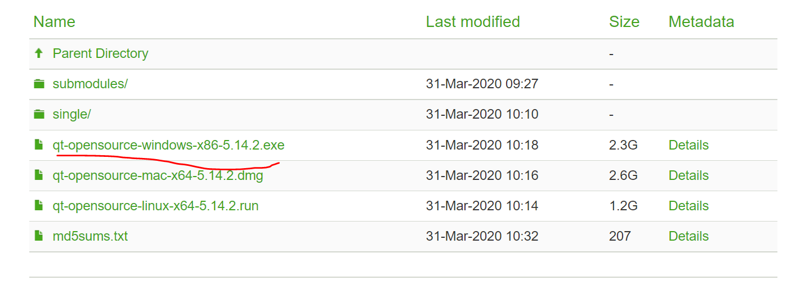

## 安装

### 1. 安装VS2022

1. 通过`https://visualstudio.microsoft.com/zh-hans/vs/`下载vs022安装程序

2. 选择如下组件：

   

### 2. Qt 5.14.2的安装

1. 从`https://download.qt.io/archive/qt/`下载QT镜像

2. 这边下载的是`5.14.2`版本

   

3. 点击exe进行安装

4. 登录账号

5. 选择安装组件

   

6. 点击下一步，一直选用默认选项安装

### 3. Qt Visual Studio Tools扩展的安装

1. 打开vs-->扩展-->管理扩展

2. 搜索`Qt Visual Studio Tools`工具并点击下载

   

3. 关闭vs，会弹出一个工具的安装界面。点击modify按钮，完成安装

4. 打开vs，可以看的扩展里面多了个`Qt VS Tools`

5. 添加QT的版本：

   

   

### 4. 新建QT工程

1. 创建工程，选择`Qt Widgets Application`

	

2. 点击下一步后

   

3. 点击创建后，点击下一步，选择需要的模块，选择默认的就可以（使用QCustomplot时，需选择Print Support，常用的还有Chart图表类型）

   

4. 点击下一步

   

5. 点击finish完成创建

###  5. 点击ui文件闪退问题

参考：`https://www.csdn.net/tags/NtjaYg0sMDk2ODItYmxvZwO0O0OO0O0O.html`

问题：新的qt vs插件在打开Qt ui文件后，qt designer的窗口虽然打开，但过几秒后突然关闭，并且显示无法打开文件

​	

解决方法：

1. 右键点击ui文件，打开右键菜单，选择打开方式

   

2. 在打开的窗口中点击“添加按钮”，打开添加程序窗口：

   

3. 点击…按钮，选择designer.exe

   

4. 点击确定后，打开方式页面中多了个 Qt Designer 选项，选中它，并设为默认，点击确定。

   

5. 之后再次双击打开ui文件，不会再自动关闭了。

## 配置VS Code

参考视频：`https://www.bilibili.com/video/BV1TZ4y1t7eq?spm_id_from=333.880.my_history.page.click&vd_source=c29a6d2c97e51402f1df9a80f1787dff`

### 1. 配置环境变量和安装插件

1. 添加环境变量

   

​	（第三个是gcc.exe的所在路径）

2. vs code配置：

   1. 安装c/c++插件

      

   2. 安装`Qt Configure`

      

      进行扩展设置

      

      配置好如下三个地方

      

   3. 安装`Qt Tools`

      

   4. 安装`CMake`和`CMake tools`插件

      

      配置cmake路径：

      

重启vs code

### 2. 测试

#### 使用Qt Configure创建工程

1. 打开一个文件夹

2. `ctrl shift P`打开命令控制台，输入`Qt Ne`，如下图所示，点击弹出的选项

   

3. 输入项目名称

   

4. 选择Qt套件

   

5. 构建工具：选择cmake

   

6. 选择是否带有ui文件

   

7. 创建完后

   

8. 编译：激活cmake

   

   出现cmake的操作菜单

   

   选择编译工具

   

   点击`Build`：

   

   build成功后点击运行按钮就可以运行了：

   s

9. 如何打开ui文件，如下图所示：

   

